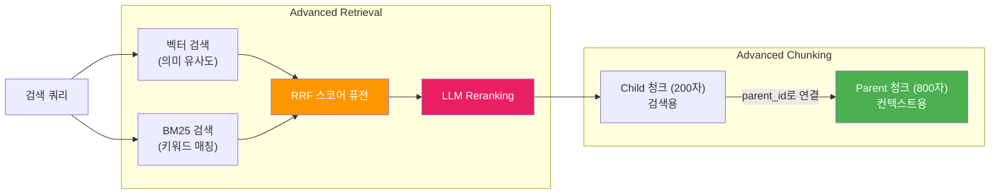
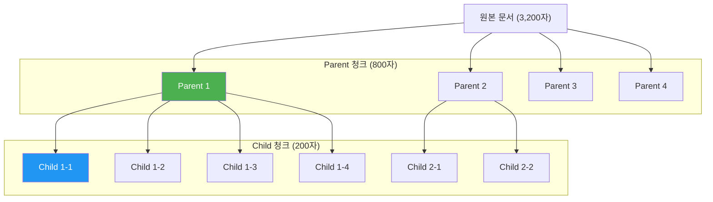
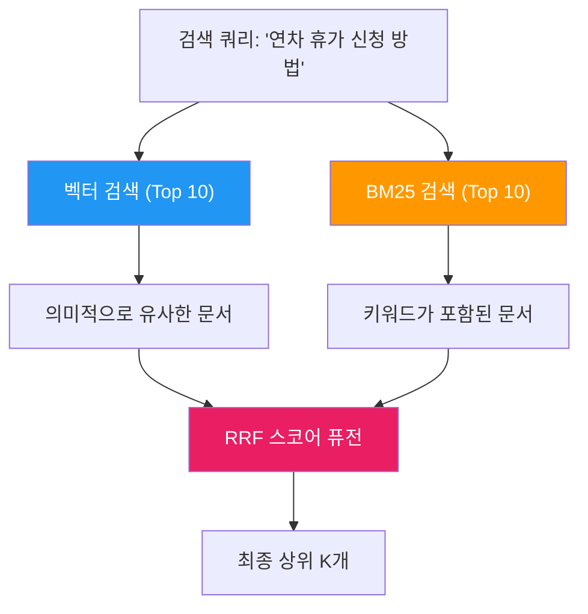
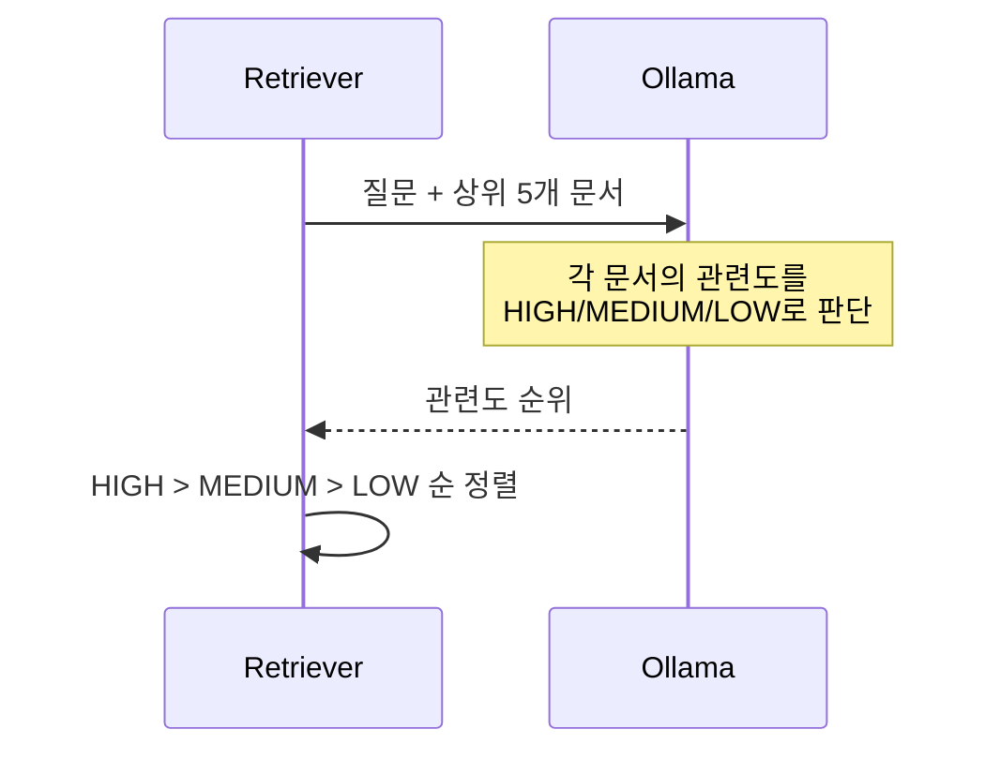

# Simple Agentic RAG - Advanced RAG 설계

## 1. 기존 대비 변경점

기존 단순 벡터 검색을 **Advanced RAG**로 교체한다. 파이프라인의 나머지(Router, Planner, Grader, HITL)는 그대로 유지한다. 임베딩 모델은 한국어 특화 `bona/bge-m3-korean`을 Ollama로 실행한다.

| 항목 | 기존 (Basic RAG) | 변경 (Advanced RAG) |
|------|-----------------|-------------------|
| **청크 전략** | 고정 500자 단순 분할 | Parent-Child 이중 청크 + 컨텍스트 헤더 |
| **검색 방식** | 벡터 유사도만 | Hybrid (벡터 + BM25 키워드) |
| **스코어 합산** | 단일 cosine distance | RRF (Reciprocal Rank Fusion) |
| **후처리** | 없음 | LLM Reranking (상위 결과 재정렬) |



---

## 2. Parent-Child Chunking

### 개념

작은 **Child 청크**(200자)로 정밀 검색하고, 실제 LLM에 전달할 때는 큰 **Parent 청크**(800자)로 충분한 컨텍스트를 제공한다.



| 파라미터 | 값 | 용도 |
|---------|-----|------|
| `parent_chunk_size` | 800자 | LLM 컨텍스트용 |
| `parent_overlap` | 100자 | 부모 간 문맥 연속성 |
| `child_chunk_size` | 200자 | 벡터 검색 정밀도 |
| `child_overlap` | 30자 | 자식 간 문맥 연속성 |

### Contextual Header

각 Child 청크 앞에 문서명과 부모 위치를 삽입하여 임베딩 품질을 향상시킨다.

```
[출처: company_policy.md | 섹션 2/4]
연차 휴가는 입사일 기준으로 매년 15일이 부여되며, 미사용 연차는...
```

---

## 3. Hybrid Search (Vector + BM25)

### BM25 키워드 검색

벡터 검색이 놓치는 정확한 키워드 매칭을 보완한다. 순수 Python으로 구현하여 외부 의존성이 없다.



### Reciprocal Rank Fusion (RRF)

두 검색 결과의 순위를 합산하는 공식:

```
RRF_score(doc) = Σ 1 / (k + rank_i(doc))
```

여기서 `k=60`은 상수, `rank_i`는 i번째 검색 방법에서의 순위이다.

---

## 4. LLM Reranking

RRF로 합산된 상위 결과를 LLM에게 질문 관련도 순으로 재정렬시킨다.



LLM reranking은 **선택적**이다. 비활성화하면 RRF 스코어만으로 결과를 반환한다.

---

## 5. ChromaDB 컬렉션 구조

기존 단일 컬렉션에서 **2개 컬렉션**으로 변경:

| 컬렉션 | 청크 크기 | 용도 |
|--------|----------|------|
| `children` | 200자 | 벡터 검색 대상 (임베딩 저장) |
| `parents` | 800자 | LLM 컨텍스트 제공 (원본 텍스트 저장) |

Child의 metadata에 `parent_id`를 저장하여 연결한다.
