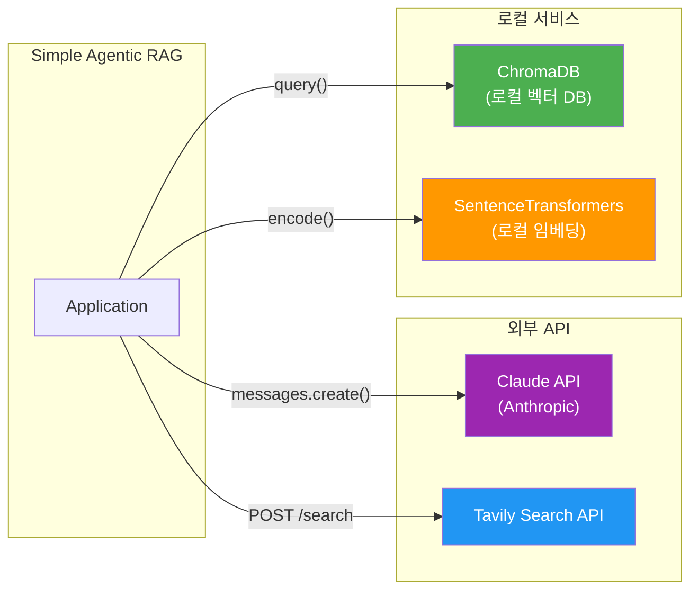
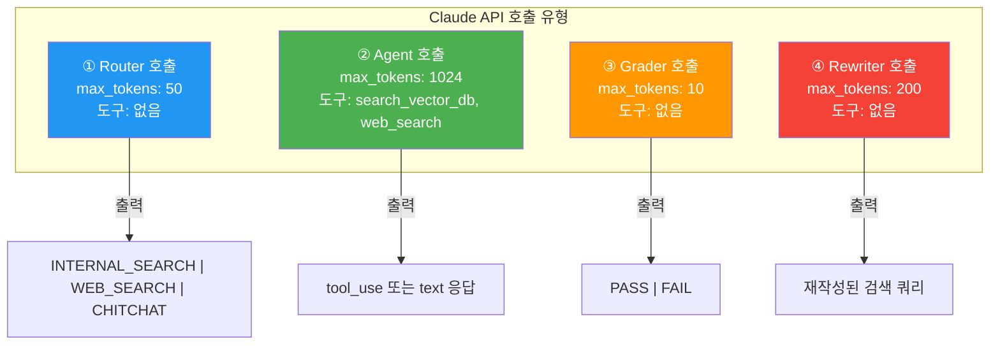
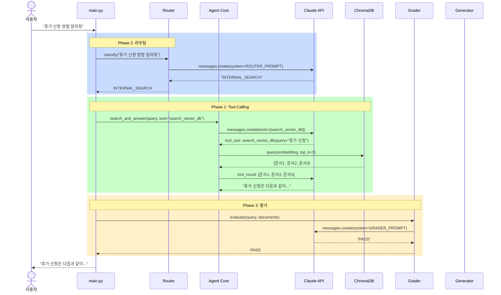
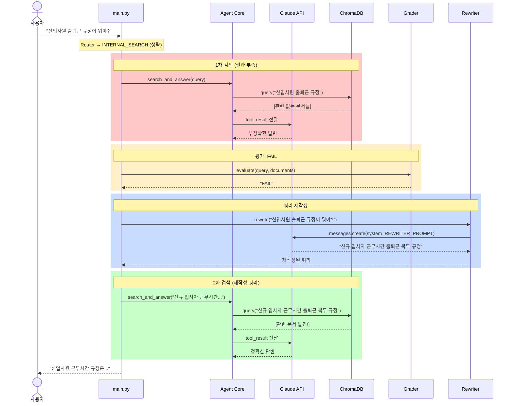
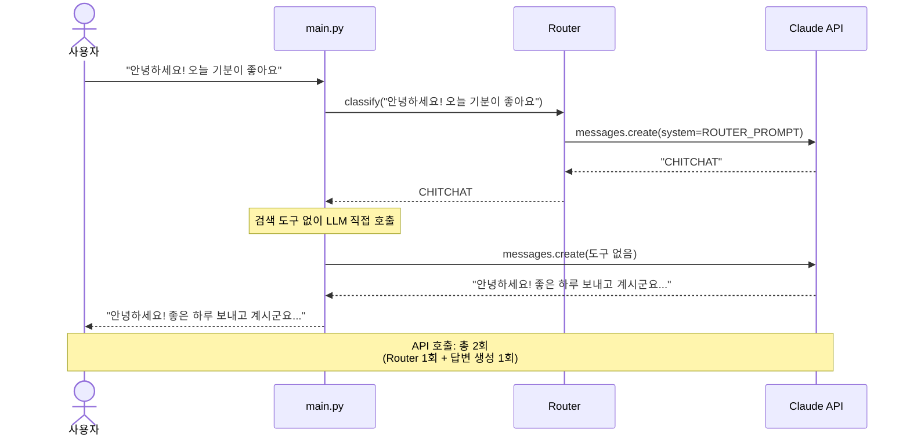
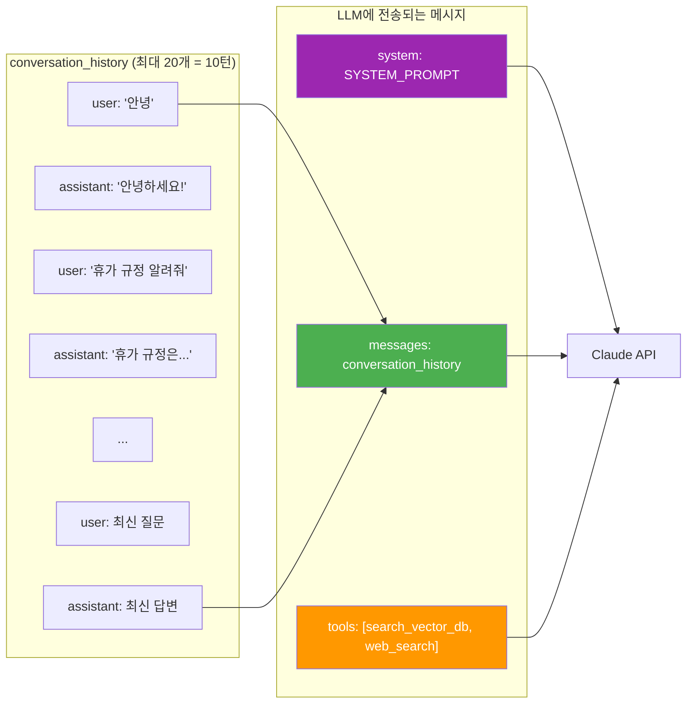
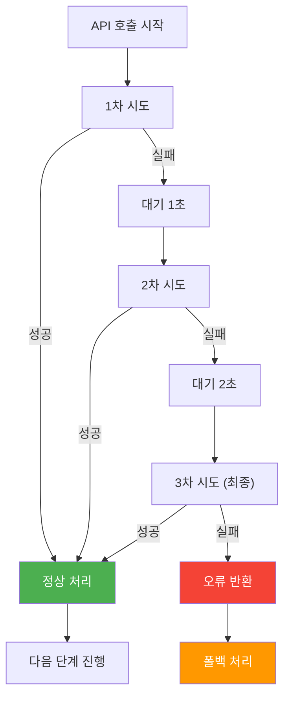

# Simple Agentic RAG - API 및 데이터 흐름 문서

## 1. 외부 API 인터페이스

### 1.1 사용하는 외부 API 목록

### 1.2 Claude API 호출 패턴

시스템 전체에서 Claude API는 **4가지 역할**로 호출된다. 각 호출은 독립적인 프롬프트와 파라미터를 사용한다.

### 1.3 API 호출 비용 분석

| 호출 유형 | 모델 | 입력 토큰 (예상) | 출력 토큰 (예상) | 호출 빈도 |
|-----------|------|------------------|------------------|-----------|
| Router | claude-sonnet | ~200 | ~5 | 매 질문 |
| Agent (검색 포함) | claude-sonnet | ~800 | ~500 | 검색 필요 시 |
| Agent (직접 답변) | claude-sonnet | ~300 | ~300 | CHITCHAT 시 |
| Grader | claude-sonnet | ~1000 | ~3 | 검색 후 |
| Rewriter | claude-sonnet | ~150 | ~30 | Grader FAIL 시 |

**1회 질문당 최대 API 호출 수**: 4회 (Router → Agent → Grader → Rewriter+재검색)
**1회 질문당 최소 API 호출 수**: 2회 (Router → Direct Answer)

---

## 2. 데이터 흐름 상세

### 2.1 전체 데이터 흐름 (Happy Path)

사내 문서 검색이 성공적으로 완료되는 이상적인 경로이다.

### 2.2 재검색 흐름 (Grader FAIL Path)

검색 결과가 부적절하여 쿼리를 재작성하고 재검색하는 경로이다.

### 2.3 단순 대화 흐름 (CHITCHAT Path)

검색이 필요 없는 일상 대화 처리 경로이다.

---

## 3. 내부 데이터 구조

### 3.1 주요 데이터 모델

### 3.2 대화 히스토리 구조

---

## 4. 상태 전이 다이어그램

### 4.1 전체 시스템 상태 머신

### 4.2 도구 호출 횟수 제어 상태

---

## 5. 인제스트 데이터 흐름

### 5.1 문서 → 벡터 변환 상세

### 5.2 검색 시 데이터 흐름

---

## 6. 에러 흐름 및 재시도 메커니즘

### 6.1 API 호출 재시도 전략

### 6.2 전체 에러 처리 매트릭스

| 컴포넌트 | 에러 유형 | 재시도 | 폴백 동작 |
|----------|----------|--------|-----------|
| **Router** | API 오류 | 2회 | `INTERNAL_SEARCH` 기본값 사용 |
| **Router** | 파싱 오류 | 0회 | `INTERNAL_SEARCH` 기본값 사용 |
| **Agent** | API 오류 | 2회 | 오류 메시지 반환 |
| **Agent** | 도구 실행 오류 | 1회 | 도구 없이 직접 답변 시도 |
| **VectorDB** | 검색 오류 | 1회 | 빈 결과로 진행 |
| **WebSearch** | API 오류 | 2회 | "검색 결과를 가져올 수 없습니다" |
| **Grader** | API 오류 | 1회 | `PASS` (안전 모드) |
| **Grader** | 파싱 오류 | 0회 | `PASS` (안전 모드) |
| **Rewriter** | API 오류 | 1회 | 원본 쿼리 그대로 재검색 |

---

## 7. 성능 최적화 포인트

### 7.1 토큰 절약 전략

### 7.2 응답 속도 최적화

| 최적화 기법 | 설명 | 예상 효과 |
|-------------|------|-----------|
| CHITCHAT 조기 반환 | 검색 불필요 질문은 Router → 직접 답변 | API 호출 2회로 감소 |
| 경량 Router 프롬프트 | Router 응답 생성 최소화 | ~100ms 절약 |
| top_k=3 제한 | 검색 결과 수 제한 | 컨텍스트 토큰 감소 |
| 임베딩 모델 캐싱 | SentenceTransformer 싱글턴 | 모델 로딩 1회만 |
| ChromaDB 로컬 실행 | 네트워크 지연 없음 | ~50ms 절약 |
