# Simple Agentic RAG - 아키텍처 설계 문서

## 1. 시스템 전체 아키텍처

### 1.1 고수준 아키텍처 (High-Level Architecture)

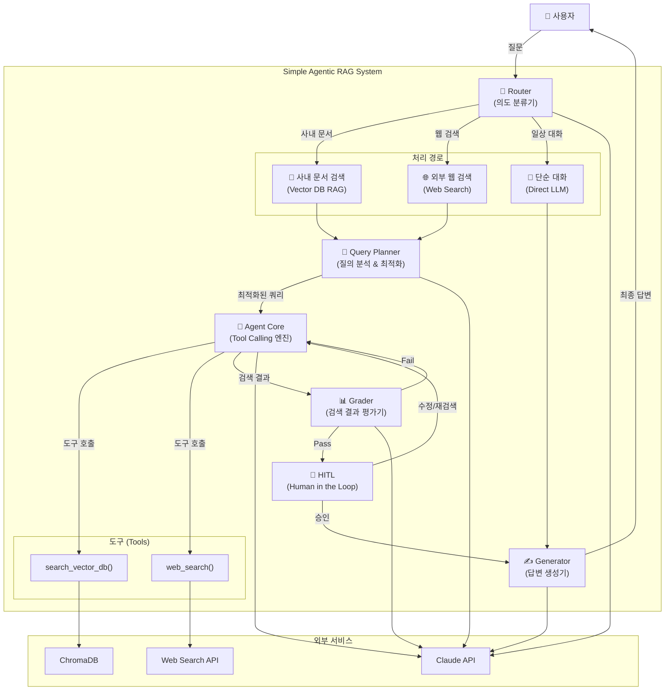

> **참고**: Query Planner와 HITL의 상세 설계는 별도 문서를 참조하세요.
> - [Query Planner 설계](./query-planner.md)
> - [Human in the Loop 설계](./human-in-the-loop.md)

### 1.2 Phase별 아키텍처 진화

```mermaid
graph LR
    subgraph "Phase 1: Tool Calling"
        P1_User["사용자"] --> P1_Agent["Agent<br/>(Tool Calling)"]
        P1_Agent --> P1_Tools["Tools"]
        P1_Agent --> P1_Gen["답변 생성"]
    end

    subgraph "Phase 2: + Router"
        P2_User["사용자"] --> P2_Router["Router"]
        P2_Router --> P2_Agent["Agent<br/>(Tool Calling)"]
        P2_Router --> P2_Direct["Direct 답변"]
        P2_Agent --> P2_Tools["Tools"]
        P2_Agent --> P2_Gen["답변 생성"]
    end

    subgraph "Phase 2.5: + Query Planner"
        P25_User["사용자"] --> P25_Router["Router"]
        P25_Router --> P25_Planner["Query<br/>Planner"]
        P25_Router --> P25_Direct["Direct 답변"]
        P25_Planner --> P25_Agent["Agent"]
        P25_Agent --> P25_Gen["답변 생성"]
    end

    subgraph "Phase 3: + Feedback Loop"
        P3_User["사용자"] --> P3_Router["Router"]
        P3_Router --> P3_Planner["Query<br/>Planner"]
        P3_Router --> P3_Direct["Direct 답변"]
        P3_Planner --> P3_Agent["Agent"]
        P3_Agent --> P3_Grader["Grader"]
        P3_Grader -->|"Pass"| P3_Gen["답변 생성"]
        P3_Grader -->|"Fail"| P3_Agent
    end

    subgraph "Phase 4: + HITL"
        P4_User["사용자"] --> P4_Router["Router"]
        P4_Router --> P4_Planner["Query<br/>Planner"]
        P4_Router --> P4_Direct["Direct 답변"]
        P4_Planner --> P4_Agent["Agent"]
        P4_Agent --> P4_Grader["Grader"]
        P4_Grader --> P4_HITL["🙋 HITL"]
        P4_HITL --> P4_Gen["답변 생성"]
    end

    style P1_Agent fill:#4CAF50,color:#fff
    style P2_Router fill:#2196F3,color:#fff
    style P25_Planner fill:#E91E63,color:#fff
    style P3_Grader fill:#FF9800,color:#fff
    style P4_HITL fill:#9C27B0,color:#fff
```

---

## 2. 핵심 컴포넌트 상세 설계

### 2.1 Agent Core (에이전트 코어)

에이전트의 핵심 루프를 담당하는 중앙 컴포넌트이다. LLM의 네이티브 Tool Calling을 통해 도구 호출 여부를 자율적으로 판단한다.

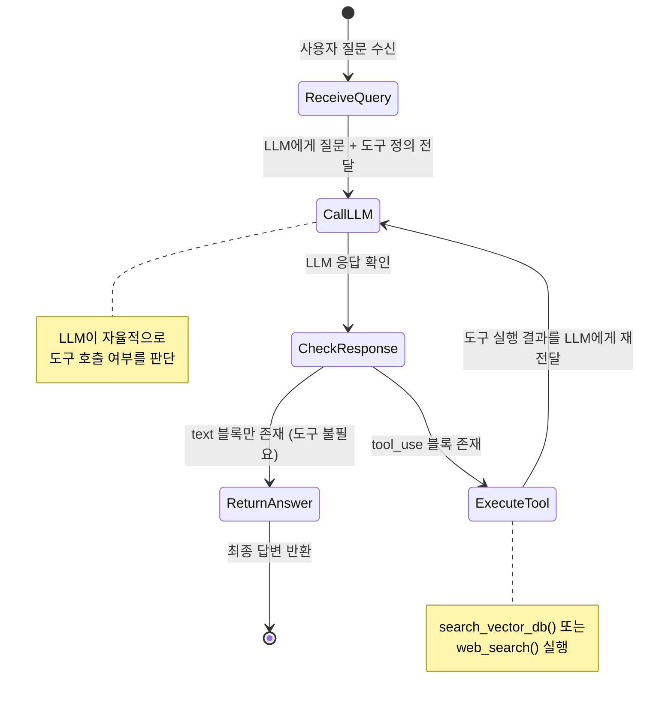

**핵심 설계 원칙:**
- 최대 도구 호출 횟수: **3회**로 제한 (무한 루프 방지)
- 대화 히스토리: 최근 **10턴**만 유지 (토큰 절약)
- 도구 정의: JSON Schema 형식으로 LLM에게 전달

### 2.2 Router (라우터)

사용자 질문을 분석하여 최적의 처리 경로로 분기하는 게이트키퍼 역할을 한다.

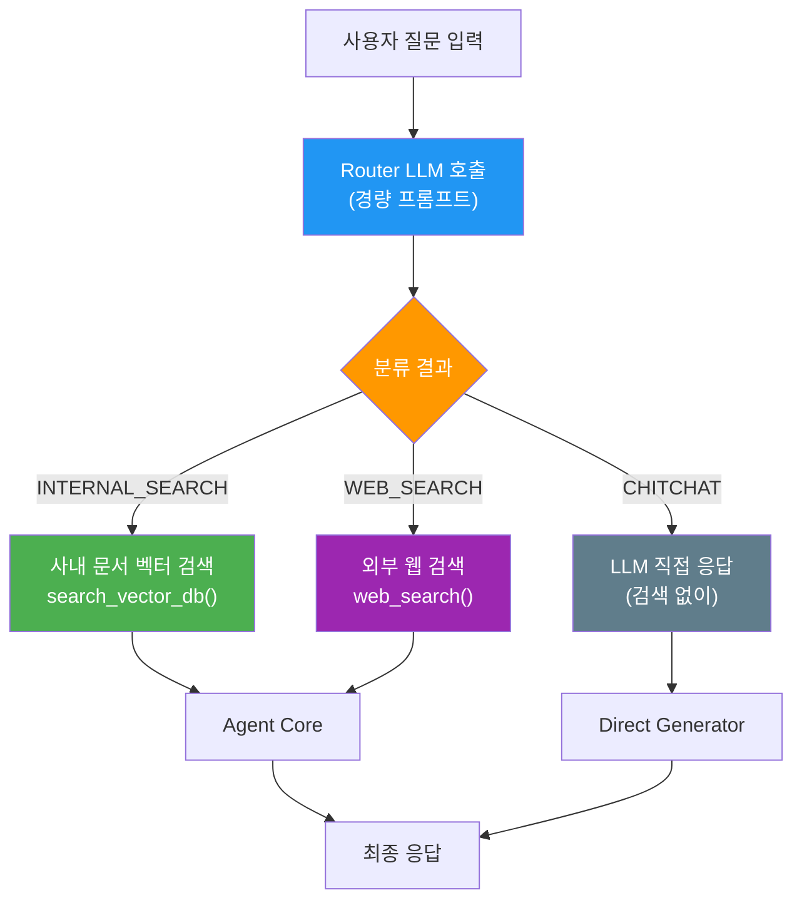

**라우팅 분류 기준:**

| 카테고리 | 트리거 조건 | 예시 |
|----------|------------|------|
| `INTERNAL_SEARCH` | 사내 문서, 정책, 가이드라인 관련 질문 | "휴가 신청 절차가 어떻게 돼?" |
| `WEB_SEARCH` | 최신 정보, 외부 데이터 필요 | "오늘 코스피 지수 알려줘" |
| `CHITCHAT` | 일반 인사, 잡담, 간단한 지식 질문 | "안녕하세요", "파이썬이 뭐야?" |

### 2.3 Query Planner (질의 분석기)

Router 이후, 검색 이전에 위치하여 사용자 질문을 벡터 검색에 최적화된 쿼리로 변환한다. 대화 맥락 해소, 핵심어 추출, 복합 질문 분해를 수행한다.

> **상세 설계**: [Query Planner 설계 문서](./query-planner.md) 참조

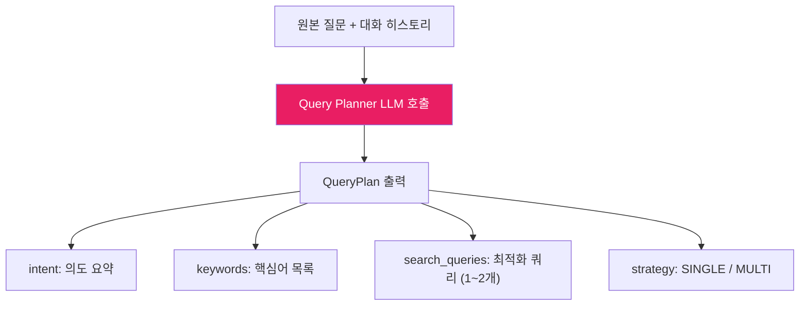

**핵심 기능:**
- **맥락 해소**: "그거 다시 알려줘" → 이전 질문 맥락 복원
- **쿼리 최적화**: 구어체 → 키워드 중심 명사구 변환
- **복합 질문 분해**: 최대 2개 서브쿼리로 분리

### 2.4 Grader (검색 결과 평가기)

검색된 문서가 사용자 질문에 답하기에 충분한지 이진(Pass/Fail) 판단을 수행한다.

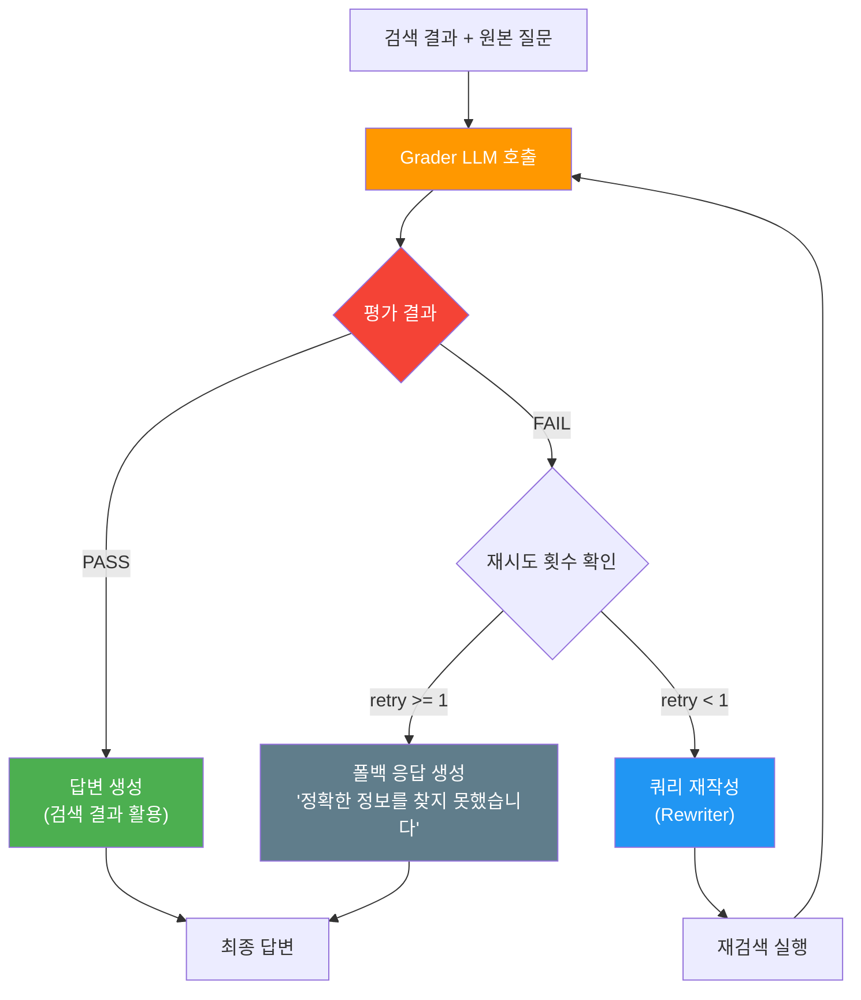

**평가 기준 (프롬프트로 제어):**
- **PASS 조건**: 검색 결과가 질문의 핵심 키워드에 관련된 정보를 포함
- **FAIL 조건**: 검색 결과가 질문과 무관하거나 정보가 불충분

### 2.5 Human in the Loop (HITL)

에이전트의 신뢰도가 낮을 때 사람에게 판단을 위임하고, 답변 후 피드백을 수집하는 메커니즘이다.

> **상세 설계**: [Human in the Loop 설계 문서](./human-in-the-loop.md) 참조

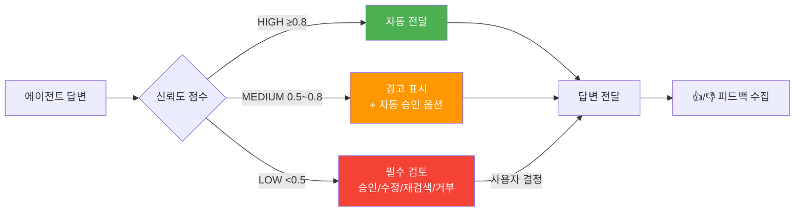

**HITL 모드:**
- `auto`: 신뢰도 기반 자동 트리거 (기본값)
- `strict`: 모든 검색 답변에 필수 검토
- `off`: HITL 비활성화

### 2.6 도구(Tools) 설계

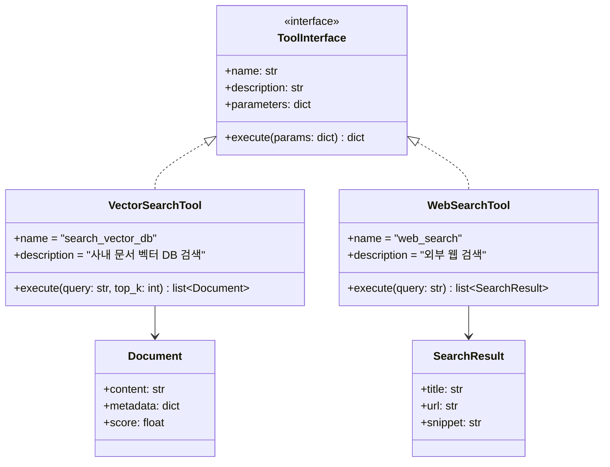

**Tool 정의 스키마 (Claude API 형식):**

```json
{
  "name": "search_vector_db",
  "description": "사내 문서 데이터베이스에서 관련 문서를 검색합니다. 사내 정책, 가이드라인, 매뉴얼 등에 대한 질문일 때 사용합니다.",
  "input_schema": {
    "type": "object",
    "properties": {
      "query": {
        "type": "string",
        "description": "검색할 쿼리 문자열"
      },
      "top_k": {
        "type": "integer",
        "description": "반환할 최대 문서 수 (기본값: 3)",
        "default": 3
      }
    },
    "required": ["query"]
  }
}
```

---

## 3. 벡터 스토어 설계

### 3.1 문서 인제스트 파이프라인

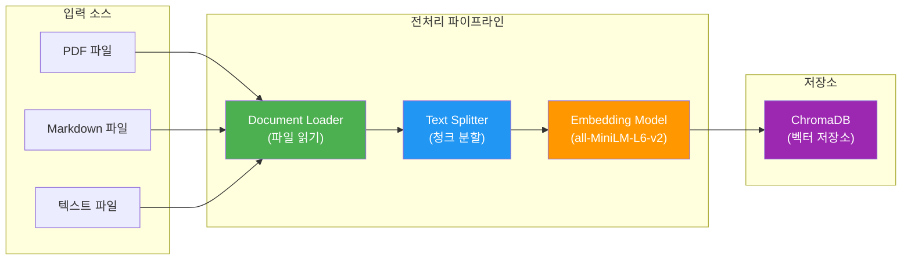

### 3.2 청크 전략

| 파라미터 | 값 | 근거 |
|----------|------|------|
| `chunk_size` | 500자 | 한국어 기준 의미 단위 유지에 적합 |
| `chunk_overlap` | 50자 | 문맥 연속성 보장 |
| `separators` | `["\n\n", "\n", ". ", " "]` | 단락 → 줄바꿈 → 문장 → 공백 순으로 분할 |

### 3.3 검색 전략

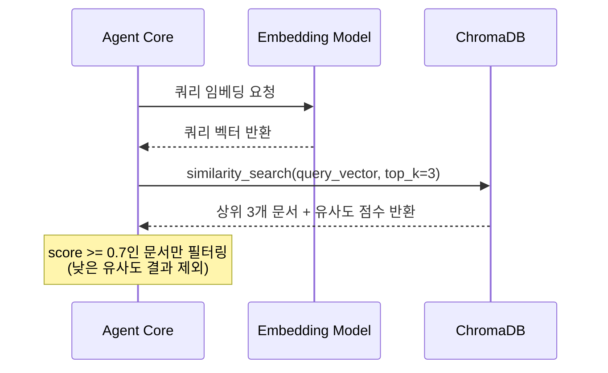

---

## 4. 프롬프트 아키텍처

### 4.1 프롬프트 분리 전략

하나의 거대한 시스템 프롬프트 대신, 역할별로 프롬프트를 분리하여 각 단계의 성능을 최적화한다.

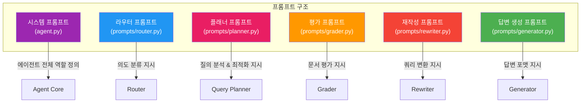

### 4.2 각 프롬프트의 역할

| 프롬프트 | 입력 | 출력 | 호출 빈도 |
|----------|------|------|-----------|
| **System** | 없음 (상시 적용) | 에이전트 행동 규칙 | 매 대화 |
| **Router** | 사용자 질문 | `INTERNAL_SEARCH` / `WEB_SEARCH` / `CHITCHAT` | 매 질문 |
| **Planner** | 질문 + 대화 히스토리 + 라우팅 결과 | QueryPlan (JSON: intent, keywords, queries, strategy) | 검색 필요 시 |
| **Grader** | 질문 + 검색 결과 | `PASS` / `FAIL` | 검색 발생 시 |
| **Rewriter** | 원본 질문 + 실패 사유 | 개선된 검색 쿼리 | Grader FAIL 시 |
| **Generator** | 질문 + (검색 결과) | 자연어 답변 | 매 답변 |

---

## 5. 에러 처리 및 폴백 전략

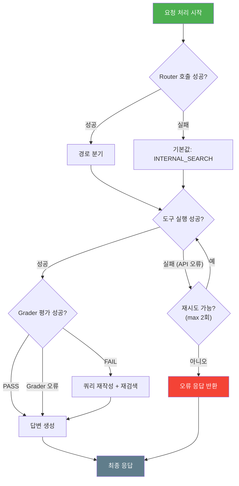

### 폴백 규칙

1. **Router 실패 시**: `INTERNAL_SEARCH`를 기본값으로 사용
2. **도구 실행 실패 시**: 최대 2회 재시도 후 오류 응답
3. **Grader 실패 시**: 검색 결과를 그대로 사용하여 답변 생성 (안전 모드)
4. **LLM API 전체 장애 시**: "현재 서비스를 이용할 수 없습니다" 정적 응답

---

## 6. 보안 고려사항

| 영역 | 위협 | 대응 |
|------|------|------|
| **프롬프트 인젝션** | 사용자가 시스템 프롬프트를 조작 | 입력 검증, 시스템/사용자 프롬프트 분리 |
| **API 키 노출** | 환경 변수 유출 | `.env` 파일 사용, `.gitignore`에 포함 |
| **데이터 유출** | 벡터 DB 내 민감 정보 | 인제스트 시 PII 필터링 |
| **토큰 남용** | 악의적 대량 요청 | 요청 Rate Limiting 적용 |
