# Simple Agentic RAG - Human in the Loop (HITL) 설계 문서

## 1. Human in the Loop이 필요한 이유

### 1.1 Agentic RAG의 신뢰성 한계

에이전트가 자율적으로 검색하고 답변을 생성하는 구조는 편리하지만, 다음과 같은 위험이 존재한다:

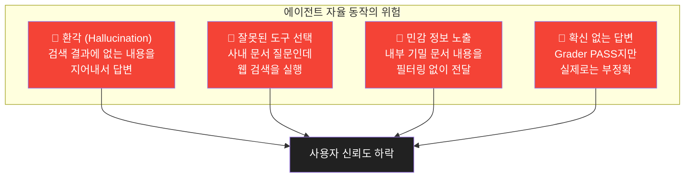

### 1.2 HITL의 핵심 철학

**"사람이 완전히 배제된 자동화는 없다."**

HITL은 에이전트가 **확신이 낮은 상황**에서 사람에게 판단을 위임하는 메커니즘이다. 모든 단계에 사람을 끌어들이는 것이 아니라, **위험도가 높은 지점에만 선택적으로** 개입시킨다.

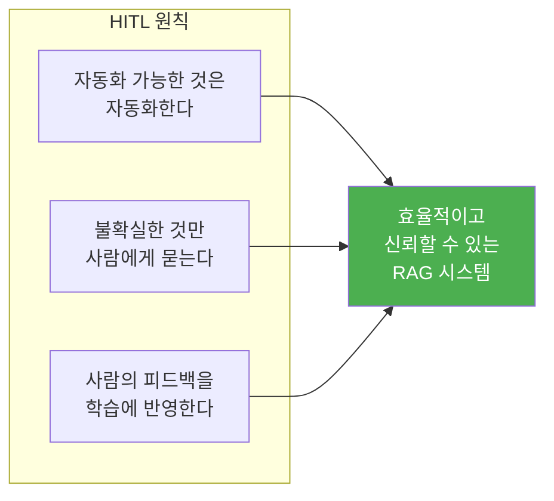

---

## 2. HITL 개입 지점 설계

### 2.1 파이프라인 내 HITL 개입 지점

전체 파이프라인에서 사람이 개입할 수 있는 **4개의 체크포인트**를 정의한다.

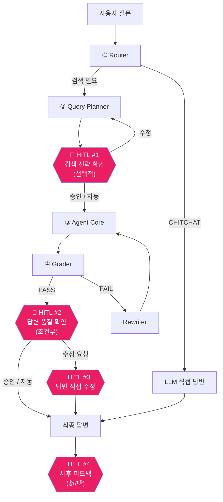

### 2.2 4개 체크포인트 상세

| 체크포인트 | 위치 | 트리거 조건 | 사용자 액션 | 필수 여부 |
|-----------|------|------------|------------|-----------|
| **HITL #1** | 검색 전 (Planner 이후) | `confidence_mode == "strict"` 일 때 | 검색 쿼리 승인/수정 | 선택 |
| **HITL #2** | 답변 생성 후 (Grader 이후) | 신뢰도 점수가 임계값 미만 | 답변 승인/거부/수정 | 조건부 |
| **HITL #3** | 답변 수정 | HITL #2에서 "수정 요청" 선택 | 답변 직접 편집 | HITL #2 의존 |
| **HITL #4** | 답변 전달 후 | 항상 (비차단) | 👍/👎 피드백 + 코멘트 | 선택 |

---

## 3. HITL 트리거 메커니즘

### 3.1 자동 트리거 (Confidence-Based)

에이전트의 **신뢰도 점수**에 따라 자동으로 HITL을 트리거하는 구조이다.

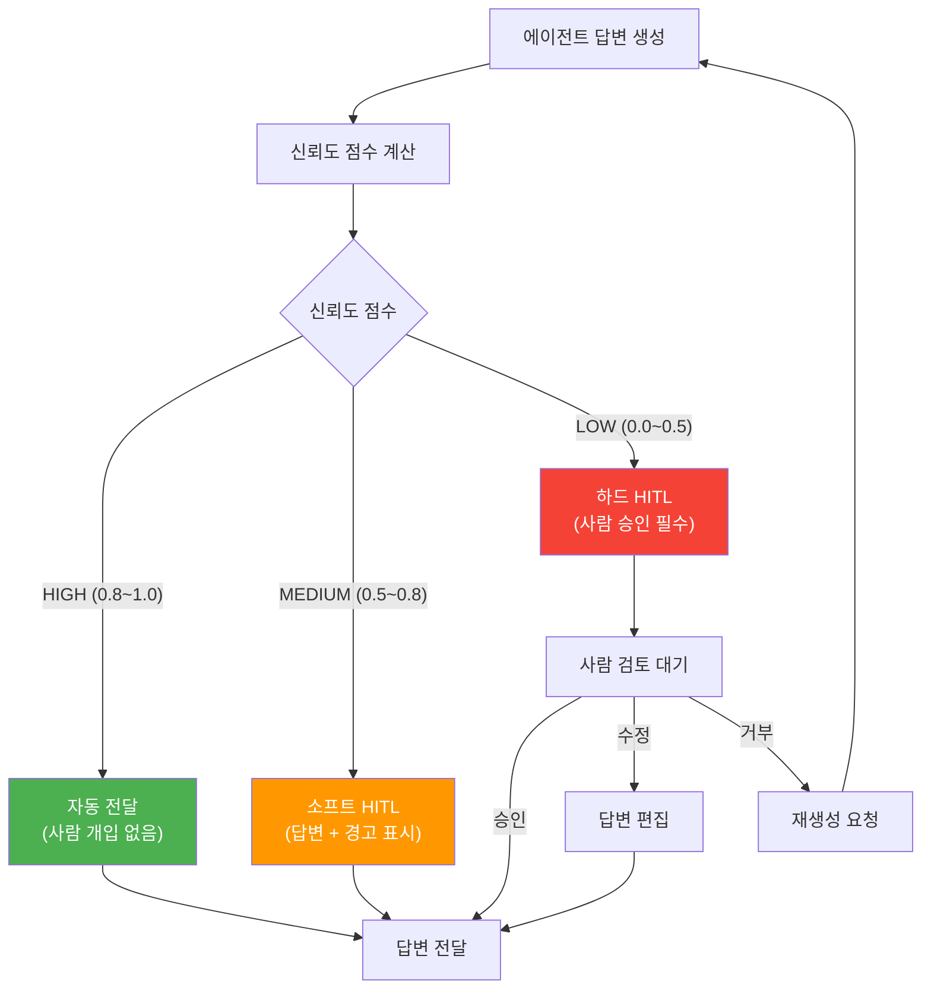

### 3.2 신뢰도 점수 산출 방식

여러 시그널을 조합하여 0~1 사이의 신뢰도 점수를 산출한다.

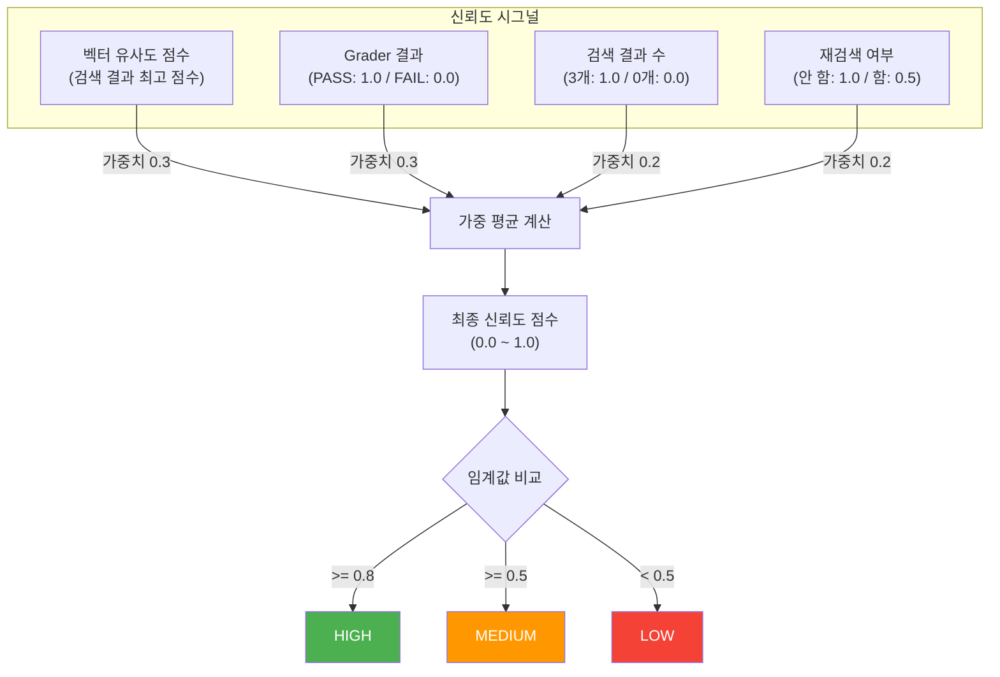

**산출 공식:**

```
confidence = (vector_similarity * 0.3)
           + (grader_pass * 0.3)
           + (doc_count_ratio * 0.2)
           + (no_retry * 0.2)
```

### 3.3 수동 트리거 (User-Initiated)

사용자가 직접 HITL 모드를 활성화하여 모든 답변을 사전 검토하는 모드이다.

| 모드 | 설명 | 사용 시나리오 |
|------|------|-------------|
| `auto` | 신뢰도 기반 자동 트리거 (기본값) | 일상 업무 |
| `strict` | 모든 검색 질문에 HITL 적용 | 중요 의사결정, 감사 대응 |
| `off` | HITL 완전 비활성화 | 빠른 응답 우선 |

---

## 4. HITL 인터페이스 설계

### 4.1 CLI 인터페이스 (Phase 1)

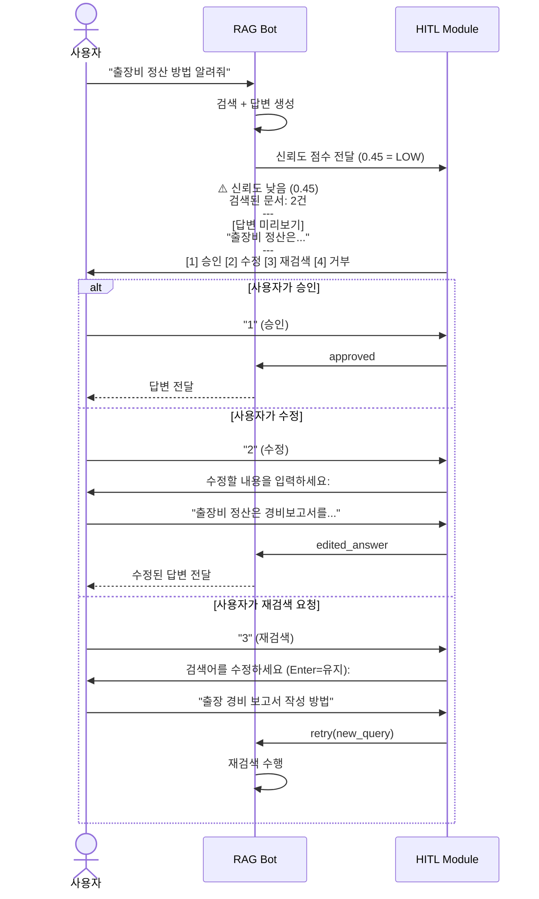

### 4.2 CLI 출력 예시

```
[사용자] 출장비 정산 방법 알려줘

  [라우팅] INTERNAL_SEARCH
  [플래닝] 의도: 출장비 정산 절차를 알고 싶음
  [플래닝] 검색어: ['출장비 경비 정산 절차 방법']
  [검색] 2건 검색됨
  [평가] PASS (유사도: 0.68)

  ⚠️  신뢰도: 0.45 (LOW) - 사람 확인 필요
  ┌─────────────────────────────────────────┐
  │  [답변 미리보기]                          │
  │                                          │
  │  출장비 정산은 출장 후 7일 이내에          │
  │  경비보고서를 작성하여 팀장 승인을          │
  │  받은 후 경리팀에 제출하면 됩니다.          │
  │                                          │
  │  참고 문서: policy.md (유사도: 0.68)       │
  └─────────────────────────────────────────┘

  [1] ✅ 승인  [2] ✏️ 수정  [3] 🔄 재검색  [4] ❌ 거부
  선택: _
```

### 4.3 사후 피드백 인터페이스 (HITL #4)

모든 답변 후에 비차단(non-blocking)으로 피드백을 수집한다.

```
[봇] 출장비 정산은 출장 후 7일 이내에 경비보고서를 작성하여...

  💬 이 답변이 도움이 되었나요? [👍 Y / 👎 N / Enter로 건너뛰기]: _
```

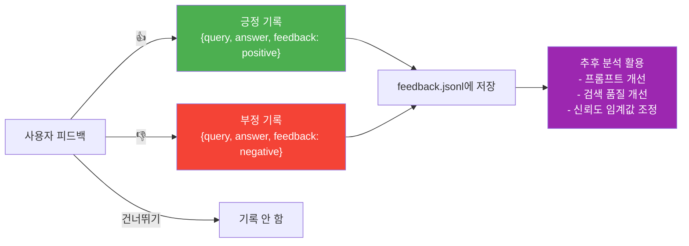

---

## 5. 구현 설계

### 5.1 클래스 설계

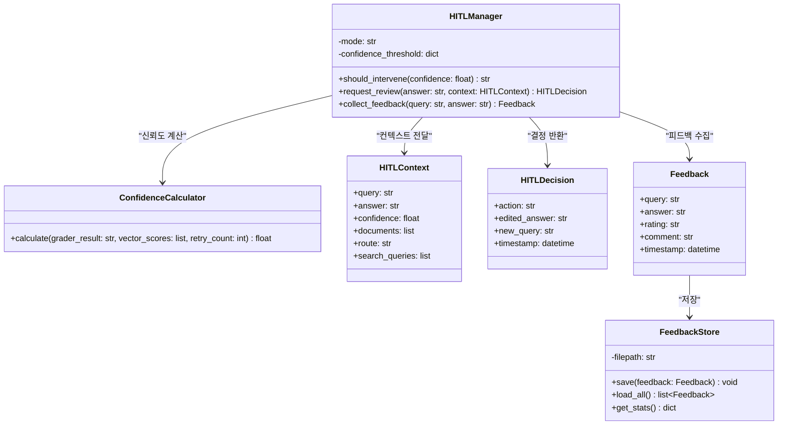

### 5.2 핵심 코드 - `hitl.py`

```python
"""
Human in the Loop (HITL) Manager

에이전트의 신뢰도가 낮을 때 사람의 판단을 요청하고,
사용자 피드백을 수집하는 모듈이다.
"""

import json
from dataclasses import dataclass, asdict
from datetime import datetime
from pathlib import Path


@dataclass
class HITLContext:
    query: str
    answer: str
    confidence: float
    documents: list
    route: str
    search_queries: list


@dataclass
class HITLDecision:
    action: str  # "approve", "edit", "retry", "reject"
    edited_answer: str = ""
    new_query: str = ""


@dataclass
class Feedback:
    query: str
    answer: str
    rating: str  # "positive", "negative"
    comment: str = ""
    timestamp: str = ""


class ConfidenceCalculator:
    """검색 결과와 평가 결과를 기반으로 신뢰도 점수를 산출한다."""

    def calculate(
        self,
        grader_result: str,
        vector_scores: list[float],
        retry_count: int
    ) -> float:
        # 1. Grader 점수 (PASS=1.0, FAIL=0.0)
        grader_score = 1.0 if grader_result == "PASS" else 0.0

        # 2. 벡터 유사도 최고 점수 (0~1)
        best_similarity = max(vector_scores) if vector_scores else 0.0

        # 3. 검색 결과 수 비율 (0~1)
        doc_ratio = min(len(vector_scores) / 3.0, 1.0)

        # 4. 재검색 패널티 (재검색 안 함=1.0, 함=0.5)
        retry_penalty = 1.0 if retry_count == 0 else 0.5

        confidence = (
            best_similarity * 0.3
            + grader_score * 0.3
            + doc_ratio * 0.2
            + retry_penalty * 0.2
        )

        return round(confidence, 2)


class HITLManager:
    """Human in the Loop 관리자."""

    THRESHOLDS = {
        "high": 0.8,   # 자동 통과
        "low": 0.5     # 필수 검토
    }

    def __init__(self, mode: str = "auto"):
        """
        mode:
          - "auto": 신뢰도 기반 자동 트리거
          - "strict": 모든 검색에 HITL 적용
          - "off": HITL 비활성화
        """
        self.mode = mode
        self.calculator = ConfidenceCalculator()

    def should_intervene(self, confidence: float) -> str:
        """HITL 개입 여부와 수준을 판단한다."""
        if self.mode == "off":
            return "none"
        if self.mode == "strict":
            return "hard"

        # auto 모드
        if confidence >= self.THRESHOLDS["high"]:
            return "none"
        elif confidence >= self.THRESHOLDS["low"]:
            return "soft"  # 경고 표시만
        else:
            return "hard"  # 필수 검토

    def request_review(self, context: HITLContext) -> HITLDecision:
        """CLI에서 사용자에게 검토를 요청한다."""

        level = self.should_intervene(context.confidence)

        if level == "none":
            return HITLDecision(action="approve")

        # 답변 미리보기 출력
        confidence_label = (
            "LOW" if context.confidence < 0.5 else "MEDIUM"
        )
        print(f"\n  ⚠️  신뢰도: {context.confidence} ({confidence_label})"
              f" - 사람 확인 필요")
        print("  ┌" + "─" * 50 + "┐")
        print("  │  [답변 미리보기]")
        for line in context.answer[:300].split("\n"):
            print(f"  │  {line}")
        if len(context.answer) > 300:
            print("  │  ...")
        print("  └" + "─" * 50 + "┘")

        if level == "soft":
            print("  💡 신뢰도 보통 - 답변이 자동 전달됩니다.")
            print("     문제가 있다면 아래에서 수정하세요.")

        print("\n  [1] ✅ 승인  [2] ✏️ 수정  [3] 🔄 재검색  [4] ❌ 거부")

        if level == "soft":
            choice = input("  선택 (Enter=자동 승인): ").strip()
            if not choice:
                return HITLDecision(action="approve")
        else:
            choice = input("  선택: ").strip()

        if choice == "1" or not choice:
            return HITLDecision(action="approve")
        elif choice == "2":
            edited = input("  수정할 답변을 입력하세요:\n  > ")
            return HITLDecision(action="edit", edited_answer=edited)
        elif choice == "3":
            new_q = input("  검색어 수정 (Enter=유지): ").strip()
            return HITLDecision(
                action="retry",
                new_query=new_q or context.search_queries[0]
            )
        elif choice == "4":
            return HITLDecision(action="reject")
        else:
            return HITLDecision(action="approve")

    def collect_feedback(self, query: str, answer: str) -> Feedback | None:
        """답변 후 사용자 피드백을 수집한다 (비차단)."""
        try:
            fb = input(
                "\n  💬 이 답변이 도움이 되었나요? "
                "[👍 Y / 👎 N / Enter=건너뛰기]: "
            ).strip().upper()

            if fb in ("Y", "👍"):
                return Feedback(
                    query=query, answer=answer, rating="positive",
                    timestamp=datetime.now().isoformat()
                )
            elif fb in ("N", "👎"):
                comment = input("  개선할 점이 있다면 알려주세요: ").strip()
                return Feedback(
                    query=query, answer=answer, rating="negative",
                    comment=comment,
                    timestamp=datetime.now().isoformat()
                )
        except (EOFError, KeyboardInterrupt):
            pass

        return None


class FeedbackStore:
    """피드백을 JSONL 파일로 저장하고 조회한다."""

    def __init__(self, filepath: str = "./data/feedback.jsonl"):
        self.filepath = Path(filepath)
        self.filepath.parent.mkdir(parents=True, exist_ok=True)

    def save(self, feedback: Feedback) -> None:
        with open(self.filepath, "a", encoding="utf-8") as f:
            f.write(json.dumps(asdict(feedback), ensure_ascii=False) + "\n")

    def load_all(self) -> list[Feedback]:
        if not self.filepath.exists():
            return []
        feedbacks = []
        with open(self.filepath, "r", encoding="utf-8") as f:
            for line in f:
                data = json.loads(line.strip())
                feedbacks.append(Feedback(**data))
        return feedbacks

    def get_stats(self) -> dict:
        all_fb = self.load_all()
        total = len(all_fb)
        positive = sum(1 for fb in all_fb if fb.rating == "positive")
        negative = total - positive
        return {
            "total": total,
            "positive": positive,
            "negative": negative,
            "satisfaction_rate": (
                round(positive / total * 100, 1) if total > 0 else 0
            )
        }
```

### 5.3 main.py 통합

```python
# main.py에 HITL 통합 (기존 코드에 추가)

from hitl import HITLManager, HITLContext, FeedbackStore

# 초기화
hitl = HITLManager(mode="auto")  # "auto" / "strict" / "off"
feedback_store = FeedbackStore()

# ... 기존 검색 + 평가 로직 이후 ...

# 신뢰도 계산
confidence = hitl.calculator.calculate(
    grader_result=grade,
    vector_scores=[doc["distance"] for doc in documents],
    retry_count=retry_count
)

# HITL 검토 요청
context = HITLContext(
    query=query,
    answer=answer,
    confidence=confidence,
    documents=documents,
    route=route,
    search_queries=plan.search_queries
)

decision = hitl.request_review(context)

if decision.action == "approve":
    final_answer = answer
elif decision.action == "edit":
    final_answer = decision.edited_answer
elif decision.action == "retry":
    # 새 쿼리로 재검색
    _, documents = agent.search_and_answer(
        decision.new_query, conversation_history, tool_filter
    )
    final_answer = generate_answer(query, documents)
elif decision.action == "reject":
    final_answer = "답변이 거부되었습니다. 다른 방법으로 질문해 주세요."

print(f"\n[봇] {final_answer}")

# 사후 피드백 수집
feedback = hitl.collect_feedback(query, final_answer)
if feedback:
    feedback_store.save(feedback)
```

---

## 6. HITL 상태 전이

### 6.1 전체 상태 머신

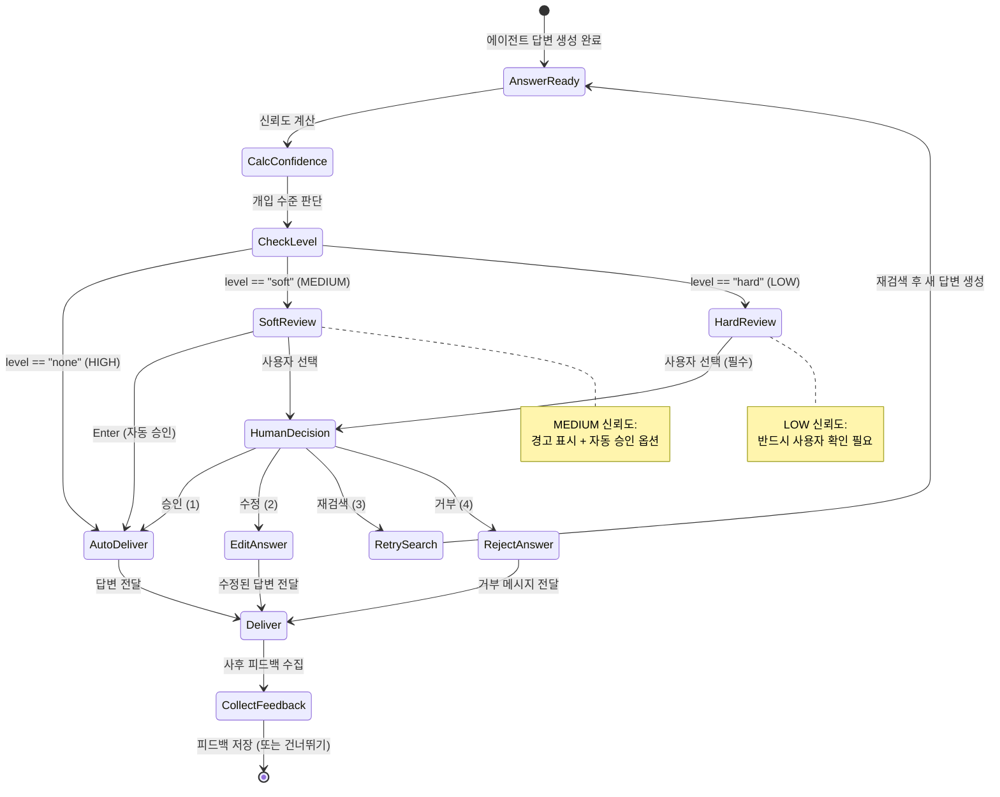

### 6.2 HITL 모드별 동작 비교

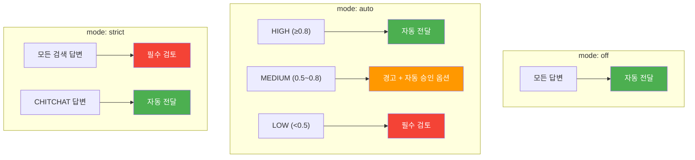

---

## 7. 피드백 데이터 활용

### 7.1 피드백 저장 형식

```jsonl
{"query": "출장비 정산 방법", "answer": "출장비 정산은...", "rating": "positive", "comment": "", "timestamp": "2026-02-24T14:30:00"}
{"query": "연차 규정 알려줘", "answer": "연차 휴가는...", "rating": "negative", "comment": "최신 규정이 반영 안 됨", "timestamp": "2026-02-24T14:35:00"}
```

### 7.2 피드백 기반 개선 사이클

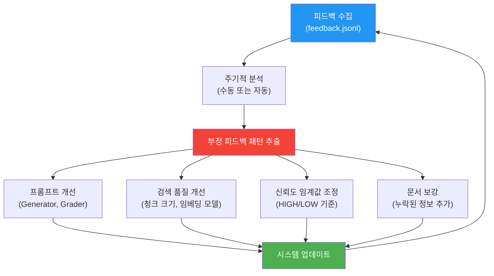

### 7.3 분석 대시보드 예시

```
📊 피드백 통계 (최근 7일)
━━━━━━━━━━━━━━━━━━━━━━━━
총 응답 수:       142
긍정 (👍):        108 (76.1%)
부정 (👎):         34 (23.9%)

🔍 부정 피드백 주요 패턴:
  1. "최신 정보가 아님" (12건) → 문서 업데이트 필요
  2. "너무 일반적인 답변" (8건) → Generator 프롬프트 개선
  3. "관련 없는 문서 참조" (7건) → 검색 품질 개선

📈 신뢰도별 정확도:
  HIGH (≥0.8):    95.2% 정확
  MEDIUM (0.5~0.8): 72.4% 정확
  LOW (<0.5):      41.7% 정확 → HITL 덕분에 최종 85%로 보정
```

---

## 8. 디렉토리 구조 변경

HITL 도입으로 추가/수정되는 파일:

```
src/
├── hitl.py                    # [신규] HITL 관리자, 신뢰도 계산기
├── prompts/
│   └── ...
├── main.py                    # [수정] HITL 통합
└── config.py                  # [수정] HITL 모드 설정 추가

data/
├── feedback.jsonl             # [신규] 사용자 피드백 저장소
└── ...

tests/
├── test_hitl.py               # [신규] HITL 모듈 테스트
└── ...
```

---

## 9. 성능 영향 분석

### 9.1 응답 시간 영향

| 시나리오 | HITL 없음 | HITL 있음 (auto) | 차이 |
|----------|----------|-----------------|------|
| HIGH 신뢰도 | 3초 | 3초 | 없음 (자동 통과) |
| MEDIUM 신뢰도 | 3초 | 3초 + 사용자 대기 | 사용자 대기만큼 |
| LOW 신뢰도 | 3초 | 3초 + 사용자 대기 | 사용자 대기만큼 |
| 재검색 선택 | - | +5초 (재검색) | 품질 향상 |

### 9.2 기대 효과

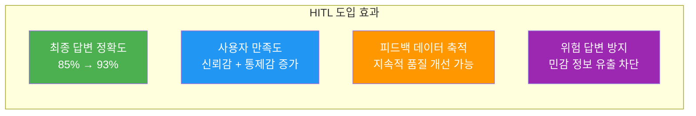
