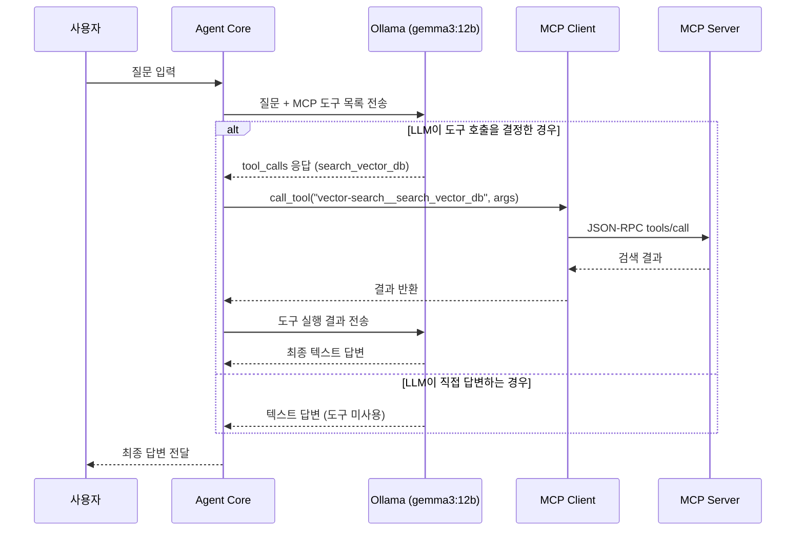
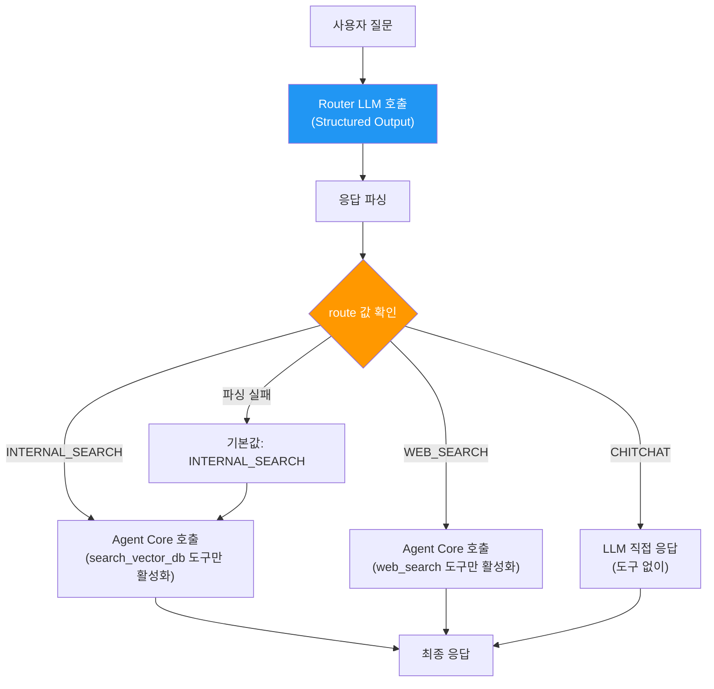
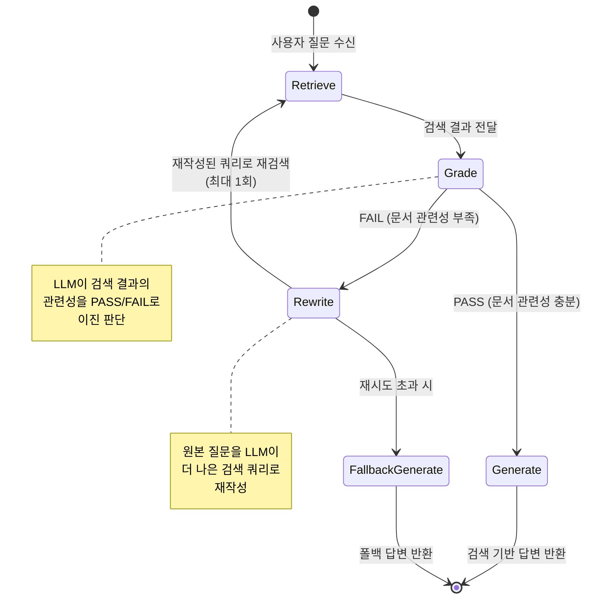
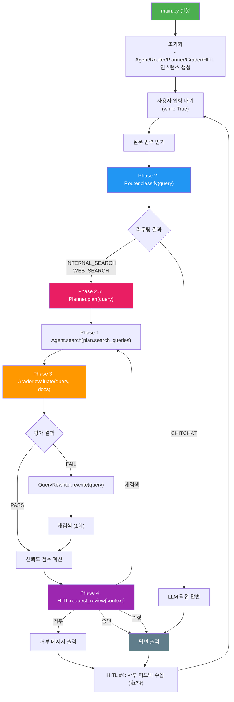
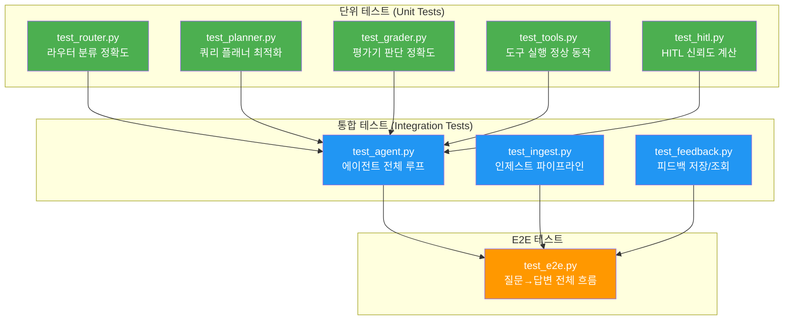

# Simple Agentic RAG - 구현 가이드

## 1. 개발 환경 설정

### 1.1 필수 패키지

```
# requirements.txt
requests>=2.31.0              # Ollama API 호출
chromadb>=0.5.0               # 벡터 데이터베이스
sentence-transformers>=3.0.0  # 임베딩 모델
python-dotenv>=1.0.0          # 환경 변수 관리
```

### 1.2 환경 변수

```bash
# .env.example
OLLAMA_URL=http://localhost:11434       # Ollama 서버 주소
LLM_MODEL=gemma3:12b                   # 사용할 LLM 모델
MCP_CONFIG_PATH=mcp_config.json        # MCP 서버 설정 경로
CHROMA_PERSIST_DIR=./data/chroma       # ChromaDB 저장 경로
EMBEDDING_MODEL=BAAI/bge-m3       # 임베딩 모델명
HITL_MODE=auto                         # HITL 모드 (auto/strict/off)
```

### 1.3 사전 준비

```bash
# Ollama 설치 및 모델 다운로드
curl -fsSL https://ollama.com/install.sh | sh
ollama pull gemma3:12b
```

---

## 2. Phase 1 구현: 네이티브 Tool Calling

### 2.1 전체 흐름



### 2.2 핵심 코드 구조 - `agent.py`

```python
"""
Agent Core - Ollama + MCP 기반 Tool Calling 루프

핵심 로직:
1. 사용자 메시지 + MCP 도구 목록을 Ollama에게 전송
2. 응답에 tool_calls가 있으면 MCP를 통해 도구 실행
3. 실행 결과를 다시 Ollama에게 전송 (반복)
4. text 응답이 나오면 최종 답변으로 반환
"""

from llm_adapter import OllamaAdapter
from mcp_client import MCPClient

MAX_TOOL_CALLS = 5  # 무한 루프 방지

class AgentCore:
    def __init__(self, llm: OllamaAdapter, mcp: MCPClient, system_prompt: str):
        self.llm = llm
        self.mcp = mcp
        self.system_prompt = system_prompt

    def run(self, messages: list) -> str:
        tools = self.mcp.get_tools_for_llm()
        full_messages = [{"role": "system", "content": self.system_prompt}] + messages

        for _ in range(MAX_TOOL_CALLS):
            response = self.llm.chat(full_messages, tools=tools)

            if not response.has_tool_calls():
                return response.content

            # 도구 호출 → MCP를 통해 실행 → 결과 수집
            full_messages.append({
                "role": "assistant",
                "content": response.content,
                "tool_calls": [{"id": tc.id, "type": "function",
                    "function": {"name": tc.name, "arguments": tc.arguments}}
                    for tc in response.tool_calls]
            })

            for tc in response.tool_calls:
                result = self.mcp.call_tool(tc.name, tc.arguments)
                full_messages.append({
                    "role": "tool", "tool_call_id": tc.id, "content": result
                })

        return "답변 생성에 실패했습니다."
```

### 2.3 MCP 서버 - `mcp_servers/vector_search_server.py`

도구는 MCP 서버로 분리되어 플러그인처럼 동작한다. 코드 수정 없이 `mcp_config.json`에 등록만 하면 된다.

```python
"""Vector Search MCP Server - 벡터 DB 검색 도구를 MCP로 제공"""

import json, sys
import chromadb
from sentence_transformers import SentenceTransformer

embedder = SentenceTransformer("BAAI/bge-m3")
chroma = chromadb.PersistentClient(path="./data/chroma")

TOOLS = [{
    "name": "search_vector_db",
    "description": "사내 문서 데이터베이스에서 관련 문서를 검색합니다.",
    "inputSchema": {
        "type": "object",
        "properties": {
            "query": {"type": "string", "description": "검색 쿼리"},
            "top_k": {"type": "integer", "default": 3}
        },
        "required": ["query"]
    }
}]

def search(query, top_k=3):
    col = chroma.get_collection("documents")
    results = col.query(
        query_embeddings=[embedder.encode(query).tolist()], n_results=top_k
    )
    docs = [{"content": d, "metadata": results["metadatas"][0][i]}
            for i, d in enumerate(results["documents"][0])]
    return {"content": [{"type": "text", "text": json.dumps(docs, ensure_ascii=False)}]}

if __name__ == "__main__":
    for line in sys.stdin:
        req = json.loads(line.strip())
        m = req.get("method", "")
        if m == "initialize":
            r = {"protocolVersion": "2024-11-05", "capabilities": {"tools": {}},
                 "serverInfo": {"name": "vector-search"}}
        elif m == "tools/list":
            r = {"tools": TOOLS}
        elif m == "tools/call":
            p = req["params"]
            r = search(p["arguments"]["query"], p["arguments"].get("top_k", 3))
        else:
            r = {}
        sys.stdout.write(json.dumps({"jsonrpc": "2.0", "id": req.get("id"), "result": r}) + "\n")
        sys.stdout.flush()
```

### 2.4 도구 설정 - `mcp_config.json`

```json
{
  "mcpServers": {
    "vector-search": {
      "command": "python",
      "args": ["src/mcp_servers/vector_search_server.py"]
    },
    "web-search": {
      "command": "python",
      "args": ["src/mcp_servers/web_search_server.py"]
    }
  }
}
```

도구를 추가하려면 이 파일에 서버만 등록하면 된다 (코드 변경 0줄).

---

## 3. Phase 2 구현: Router 패턴

### 3.1 라우팅 흐름



### 3.2 Router 구현 - `router.py`

```python
"""
Router - 사용자 질문 의도 분류기

경량 LLM 호출로 질문을 3가지 카테고리로 분류한다.
"""

from llm_adapter import OllamaAdapter
from prompts.router import ROUTER_PROMPT

class Router:
    VALID_ROUTES = {"INTERNAL_SEARCH", "WEB_SEARCH", "CHITCHAT"}

    def __init__(self, llm: OllamaAdapter):
        self.llm = llm

    def classify(self, query: str) -> str:
        """사용자 질문을 분류하여 라우팅 경로를 반환한다."""

        response = self.llm.chat(messages=[
            {"role": "system", "content": ROUTER_PROMPT},
            {"role": "user", "content": query}
        ])

        route = response.content.strip().upper()

        if route not in self.VALID_ROUTES:
            return "INTERNAL_SEARCH"  # 폴백

        return route
```

### 3.3 Router 프롬프트 - `prompts/router.py`

```python
ROUTER_PROMPT = """당신은 사용자 질문을 분류하는 라우터입니다.
사용자의 질문을 읽고 아래 세 가지 카테고리 중 하나만 정확히 출력하세요.

## 카테고리

- INTERNAL_SEARCH: 사내 문서, 정책, 가이드라인, 업무 절차, 회사 관련 질문
- WEB_SEARCH: 최신 뉴스, 실시간 데이터, 외부 기술 정보, 날씨, 주가 등
- CHITCHAT: 일반 인사, 잡담, 프로그래밍 기초 지식 등 검색이 필요 없는 질문

## 규칙

1. 반드시 위 세 단어 중 하나만 출력하세요.
2. 어떤 설명도 추가하지 마세요.
3. 확실하지 않으면 INTERNAL_SEARCH를 선택하세요.

## 출력 형식

카테고리_이름"""
```

---

## 4. Phase 3 구현: 단일 피드백 루프

### 4.1 CRAG 간소화 상태 머신



### 4.2 Grader 구현 - `grader.py`

```python
"""
Grader - 검색 결과 관련성 평가기

검색된 문서가 사용자 질문에 답하기 충분한지 이진 판단(PASS/FAIL)을 수행한다.
"""

from llm_adapter import OllamaAdapter
from prompts.grader import GRADER_PROMPT

class Grader:
    def __init__(self, llm: OllamaAdapter):
        self.llm = llm

    def evaluate(self, query: str, documents: list[dict]) -> str:
        """검색 결과의 관련성을 평가한다."""

        docs_text = "\n\n---\n\n".join(
            f"[문서 {i+1}]\n{doc['content']}"
            for i, doc in enumerate(documents)
        )

        response = self.llm.chat(messages=[
            {"role": "system", "content": GRADER_PROMPT},
            {
                "role": "user",
                "content": (
                    f"## 사용자 질문\n{query}\n\n"
                    f"## 검색된 문서\n{docs_text}"
                )
            }
        ])

        result = response.content.strip().upper()
        return result if result in ("PASS", "FAIL") else "PASS"
```

### 4.3 Query Rewriter 구현

```python
"""
Rewriter - 검색 쿼리 재작성기

Grader에서 FAIL 판정을 받은 경우, 원본 질문을 더 나은 검색 쿼리로 변환한다.
"""

from llm_adapter import OllamaAdapter
from prompts.rewriter import REWRITER_PROMPT

class QueryRewriter:
    def __init__(self, llm: OllamaAdapter):
        self.llm = llm

    def rewrite(self, original_query: str) -> str:
        """원본 질문을 개선된 검색 쿼리로 재작성한다."""

        response = self.llm.chat(messages=[
            {"role": "system", "content": REWRITER_PROMPT},
            {"role": "user", "content": f"원본 질문: {original_query}"}
        ])

        return response.content.strip()
```

### 4.4 Grader 프롬프트 - `prompts/grader.py`

```python
GRADER_PROMPT = """당신은 검색 결과 평가자입니다.
사용자의 질문과 검색된 문서를 비교하여 문서가 질문에 답하기에 충분한지 판단합니다.

## 판단 기준

PASS: 검색된 문서 중 하나 이상이 질문의 핵심 키워드나 주제와 관련된 정보를 포함
FAIL: 검색된 문서가 질문과 전혀 무관하거나 필요한 정보가 전혀 없음

## 규칙

1. PASS 또는 FAIL 중 하나만 출력하세요.
2. 부분적으로라도 관련 있으면 PASS입니다.
3. 확신이 없으면 PASS를 선택하세요.

## 출력 형식

PASS 또는 FAIL"""
```

### 4.5 Rewriter 프롬프트 - `prompts/rewriter.py`

```python
REWRITER_PROMPT = """당신은 검색 쿼리 최적화 전문가입니다.
사용자의 원본 질문을 벡터 데이터베이스 검색에 더 적합한 형태로 재작성합니다.

## 재작성 규칙

1. 핵심 키워드를 추출하여 명확하게 표현
2. 불필요한 조사, 어미를 제거
3. 동의어나 관련 용어를 추가하여 검색 범위 확대
4. 원본 질문의 의도를 절대 변경하지 마세요
5. 재작성된 쿼리만 출력하세요 (설명 없이)

## 예시

원본: "회사에서 연차 쓰려면 어떻게 해야 해?"
재작성: "연차 휴가 신청 절차 방법 가이드"

원본: "새로 입사했는데 뭐부터 해야 하지?"
재작성: "신규 입사자 온보딩 체크리스트 절차"

## 출력 형식

재작성된 검색 쿼리 (한 줄)"""
```

---

## 5. 전체 통합: `main.py`

### 5.1 통합 실행 흐름 (Phase 1~4 전체)



### 5.2 통합 코드 스케치

```python
"""
main.py - Simple Agentic RAG 진입점

Phase 1~4를 모두 통합한 최종 실행 파일이다.
- Phase 1: 네이티브 Tool Calling (Ollama + MCP)
- Phase 2: Router 패턴
- Phase 2.5: Query Planner
- Phase 3: 단일 피드백 루프 (CRAG)
- Phase 4: Human in the Loop
"""

from llm_adapter import OllamaAdapter
from mcp_client import MCPClient
from agent import AgentCore
from router import Router
from planner import QueryPlanner
from grader import Grader, QueryRewriter
from hitl import HITLManager, HITLContext, FeedbackStore
from prompts.system import SYSTEM_PROMPT
from config import Config

def main():
    config = Config()

    # 핵심 인프라 초기화
    llm = OllamaAdapter(model=config.llm_model, base_url=config.ollama_url)
    mcp = MCPClient(config_path=config.mcp_config_path)
    mcp.connect_all()

    # 파이프라인 컴포넌트 초기화 (모두 같은 LLM 인스턴스 공유)
    agent = AgentCore(llm=llm, mcp=mcp, system_prompt=SYSTEM_PROMPT)
    router = Router(llm=llm)
    planner = QueryPlanner(llm=llm)
    grader = Grader(llm=llm)
    rewriter = QueryRewriter(llm=llm)
    hitl = HITLManager(mode=config.hitl_mode)  # "auto" / "strict" / "off"
    feedback_store = FeedbackStore()

    conversation_history = []

    print("Simple Agentic RAG Bot (종료: quit)")

    while True:
        query = input("\n[사용자] ").strip()
        if query.lower() in ("quit", "exit", "종료"):
            break

        # Phase 2: 라우팅
        route = router.classify(query)
        print(f"  [라우팅] {route}")

        if route == "CHITCHAT":
            answer = agent.direct_answer(query, conversation_history)
            print(f"\n[봇] {answer}")
        else:
            # Phase 2.5: 질의 분석 & 최적화
            plan = planner.plan(query, route, conversation_history)
            print(f"  [플래닝] 의도: {plan.intent}")
            print(f"  [플래닝] 검색어: {plan.search_queries}")

            tool_filter = (
                "search_vector_db" if route == "INTERNAL_SEARCH"
                else "web_search"
            )

            # Phase 1: Tool Calling 기반 검색 (최적화된 쿼리 사용)
            if plan.is_multi():
                all_documents = []
                for sq in plan.search_queries:
                    _, docs = agent.search_and_answer(
                        sq, conversation_history, tool_filter
                    )
                    all_documents.extend(docs)
                # 중복 제거
                seen = set()
                documents = []
                for doc in all_documents:
                    key = doc["content"][:100]
                    if key not in seen:
                        seen.add(key)
                        documents.append(doc)
                answer = agent.generate_from_docs(query, documents)
            else:
                answer, documents = agent.search_and_answer(
                    plan.search_queries[0], conversation_history, tool_filter
                )

            # Phase 3: 검색 결과 평가
            retry_count = 0
            if documents:
                grade = grader.evaluate(query, documents)
                print(f"  [평가] {grade}")

                if grade == "FAIL":
                    rewritten = rewriter.rewrite(query)
                    print(f"  [재작성] {rewritten}")
                    answer, documents = agent.search_and_answer(
                        rewritten, conversation_history, tool_filter
                    )
                    retry_count = 1
                    grade = "PASS"  # 재검색 후 강제 진행

            # Phase 4: Human in the Loop
            confidence = hitl.calculator.calculate(
                grader_result=grade if documents else "PASS",
                vector_scores=[d.get("distance", 0) for d in documents],
                retry_count=retry_count
            )

            context = HITLContext(
                query=query, answer=answer,
                confidence=confidence, documents=documents,
                route=route, search_queries=plan.search_queries
            )

            decision = hitl.request_review(context)

            if decision.action == "approve":
                final_answer = answer
            elif decision.action == "edit":
                final_answer = decision.edited_answer
            elif decision.action == "retry":
                final_answer, _ = agent.search_and_answer(
                    decision.new_query, conversation_history, tool_filter
                )
            elif decision.action == "reject":
                final_answer = "답변이 거부되었습니다. 다른 방법으로 질문해 주세요."
            else:
                final_answer = answer

            print(f"\n[봇] {final_answer}")
            answer = final_answer

        # 대화 히스토리 관리 (최근 10턴)
        conversation_history.append({"role": "user", "content": query})
        conversation_history.append({"role": "assistant", "content": answer})
        conversation_history = conversation_history[-20:]  # 10턴 = 20개 메시지

        # 사후 피드백 수집
        feedback = hitl.collect_feedback(query, answer)
        if feedback:
            feedback_store.save(feedback)

    # MCP 서버 종료
    mcp.disconnect_all()

if __name__ == "__main__":
    main()
```

---

## 6. 문서 인제스트 구현 - `vectorstore/ingest.py`

### 6.1 인제스트 파이프라인


### 6.2 구현 코드

```python
"""
ingest.py - 문서 인제스트 파이프라인

data/documents/ 폴더의 파일을 읽어 ChromaDB에 벡터로 저장한다.
"""

import os
import glob
import chromadb
from sentence_transformers import SentenceTransformer

CHUNK_SIZE = 500
CHUNK_OVERLAP = 50

def chunk_text(text: str) -> list[str]:
    """텍스트를 고정 크기 청크로 분할한다."""
    chunks = []
    start = 0
    while start < len(text):
        end = start + CHUNK_SIZE
        chunk = text[start:end]
        chunks.append(chunk)
        start = end - CHUNK_OVERLAP
    return chunks

def ingest_documents(docs_dir: str = "./data/documents"):
    """문서 디렉토리의 모든 파일을 벡터 DB에 인제스트한다."""

    embedder = SentenceTransformer("BAAI/bge-m3")
    client = chromadb.PersistentClient(path="./data/chroma")

    # 기존 컬렉션이 있으면 삭제 후 재생성
    try:
        client.delete_collection("documents")
    except ValueError:
        pass

    collection = client.create_collection(
        name="documents",
        metadata={"hnsw:space": "cosine"}
    )

    all_chunks = []
    all_metadatas = []
    all_ids = []

    # 지원 확장자
    extensions = ["*.txt", "*.md", "*.pdf"]

    for ext in extensions:
        for filepath in glob.glob(os.path.join(docs_dir, "**", ext), recursive=True):
            with open(filepath, "r", encoding="utf-8") as f:
                text = f.read()

            chunks = chunk_text(text)
            filename = os.path.basename(filepath)

            for i, chunk in enumerate(chunks):
                all_chunks.append(chunk)
                all_metadatas.append({
                    "source": filename,
                    "chunk_index": i
                })
                all_ids.append(f"{filename}_{i}")

    if not all_chunks:
        print("인제스트할 문서가 없습니다.")
        return

    # 배치 임베딩 및 저장
    embeddings = embedder.encode(all_chunks).tolist()

    collection.add(
        documents=all_chunks,
        embeddings=embeddings,
        metadatas=all_metadatas,
        ids=all_ids
    )

    print(f"총 {len(all_chunks)}개 청크를 인제스트했습니다.")

if __name__ == "__main__":
    ingest_documents()
```

---

## 7. 테스트 전략

### 7.1 테스트 구조



### 7.2 테스트 케이스 예시

| 테스트 | 입력 | 기대 결과 |
|--------|------|-----------|
| Router - 사내 문서 | "휴가 신청 방법 알려줘" | `INTERNAL_SEARCH` |
| Router - 웹 검색 | "오늘 서울 날씨 어때?" | `WEB_SEARCH` |
| Router - 잡담 | "안녕하세요!" | `CHITCHAT` |
| Planner - 맥락 해소 | "그거 다시 알려줘" (이전: 휴가) | 쿼리에 "휴가" 포함 |
| Planner - 복합 질문 | "휴가 규정이랑 출장비" | `strategy: MULTI`, 쿼리 2개 |
| Planner - 쿼리 최적화 | "어떻게 하면 돼?" | 명사구 중심 쿼리 변환 |
| Grader - 관련 문서 | 질문과 관련된 문서 제공 | `PASS` |
| Grader - 무관 문서 | 질문과 무관한 문서 제공 | `FAIL` |
| Rewriter | "회사에서 연차 쓰려면?" | 핵심 키워드 포함 쿼리 |
| HITL - HIGH 신뢰도 | confidence=0.9 | `should_intervene() == "none"` |
| HITL - LOW 신뢰도 | confidence=0.3 | `should_intervene() == "hard"` |
| HITL - 신뢰도 계산 | PASS, 유사도 0.8, 재시도 0 | confidence >= 0.7 |
| Agent - 도구 호출 | 사내 문서 질문 | `search_vector_db` 호출됨 |
| Agent - 직접 답변 | "1+1은?" | 도구 미호출, 직접 답변 |
| Feedback - 저장 | 긍정 피드백 | JSONL에 정상 기록 |

---

## 8. 구현 체크리스트

### Phase 1: 네이티브 Tool Calling (Ollama + MCP)

- [ ] 프로젝트 초기 설정 (`requirements.txt`, `.env`, `.gitignore`)
- [ ] Ollama 설치 및 `gemma3:12b` 모델 다운로드
- [ ] `config.py` - 설정 관리 모듈
- [ ] `llm_adapter.py` - OllamaAdapter (LLM 추상화)
- [ ] `mcp_client.py` - MCP 클라이언트
- [ ] `mcp_servers/vector_search_server.py` - 벡터 검색 MCP 서버
- [ ] `mcp_servers/web_search_server.py` - 웹 검색 MCP 서버
- [ ] `mcp_config.json` - MCP 서버 설정
- [ ] `agent.py` - 에이전트 코어 (Ollama + MCP Tool Calling 루프)
- [ ] `vectorstore/ingest.py` - 문서 인제스트
- [ ] `main.py` - 기본 CLI 인터페이스
- [ ] Phase 1 테스트 작성 및 통과

### Phase 2: Router 패턴

- [ ] `prompts/router.py` - 라우터 프롬프트
- [ ] `router.py` - 라우터 구현
- [ ] `main.py` 에 라우터 통합
- [ ] Phase 2 테스트 작성 및 통과

### Phase 2.5: Query Planner

- [ ] `prompts/planner.py` - 플래너 프롬프트
- [ ] `planner.py` - Query Planner 구현 (맥락 해소, 쿼리 최적화, 복합 질문 분해)
- [ ] `main.py` 에 플래너 통합 (SINGLE/MULTI 전략 처리)
- [ ] Phase 2.5 테스트 작성 및 통과

### Phase 3: 단일 피드백 루프

- [ ] `prompts/grader.py` - 평가 프롬프트
- [ ] `prompts/rewriter.py` - 재작성 프롬프트
- [ ] `grader.py` - 평가기 및 재작성기 구현
- [ ] `main.py` 에 피드백 루프 통합
- [ ] Phase 3 테스트 작성 및 통과

### Phase 4: Human in the Loop

- [ ] `hitl.py` - HITL 관리자, 신뢰도 계산기, 피드백 수집기
- [ ] `hitl.py` - FeedbackStore (JSONL 저장/조회)
- [ ] `config.py` 에 HITL 모드 설정 추가 (`auto`/`strict`/`off`)
- [ ] `main.py` 에 HITL 통합 (신뢰도 계산 → 검토 요청 → 피드백 수집)
- [ ] Phase 4 테스트 작성 및 통과
- [ ] E2E 테스트 작성 및 통과 (전체 Phase 1~4 통합)
