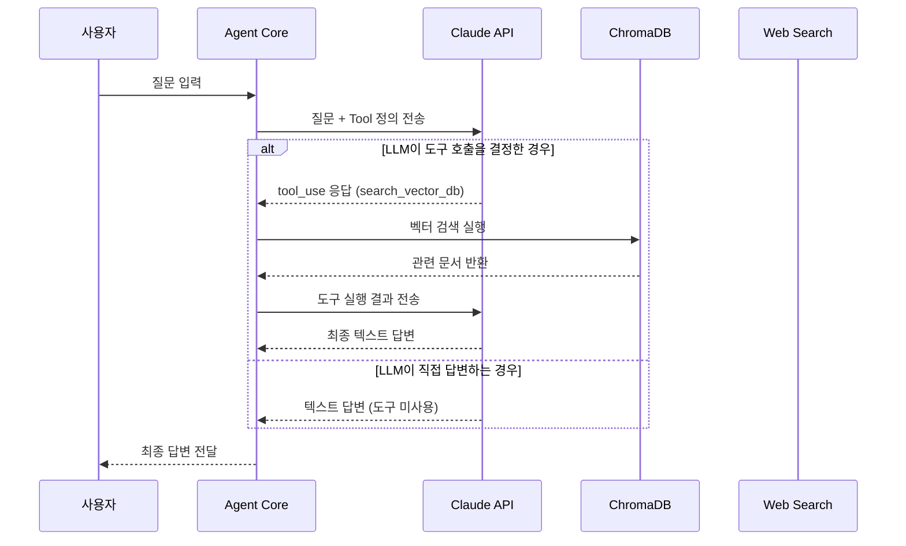
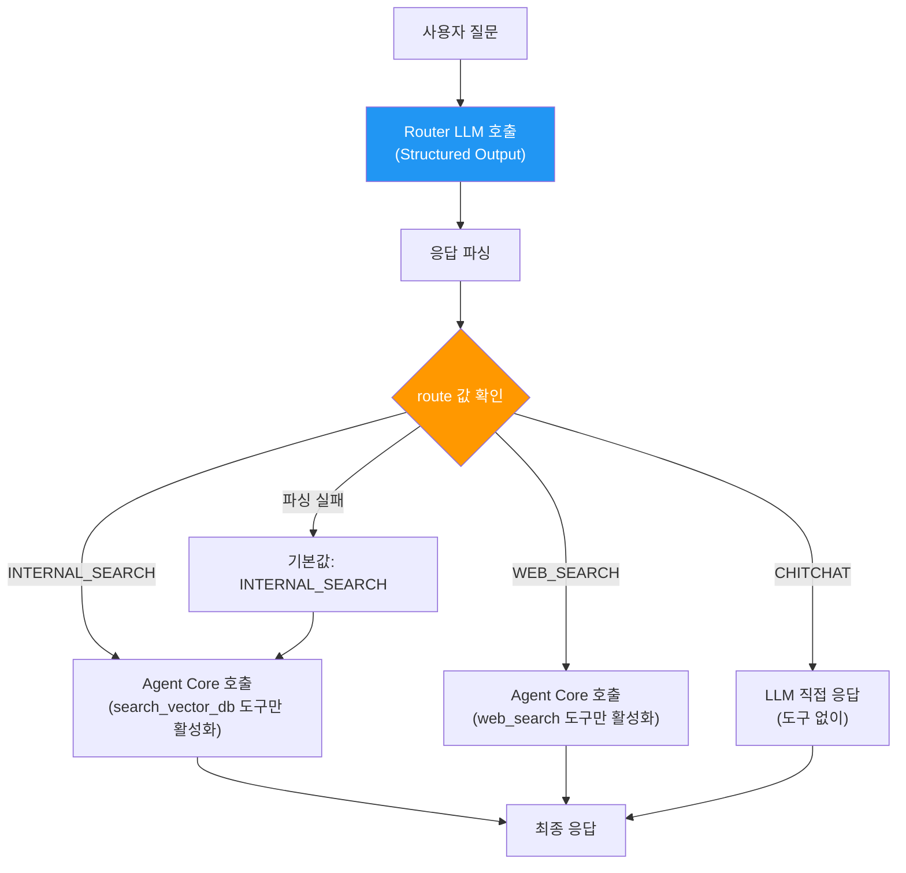
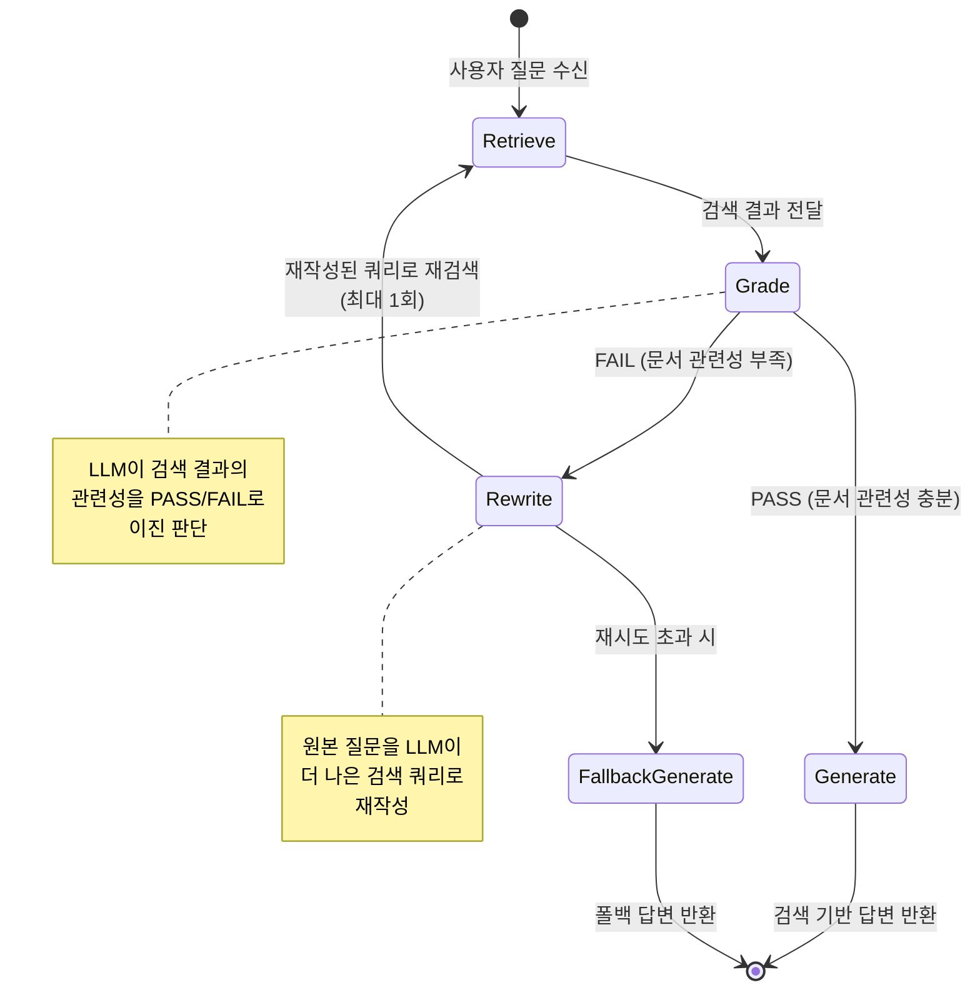
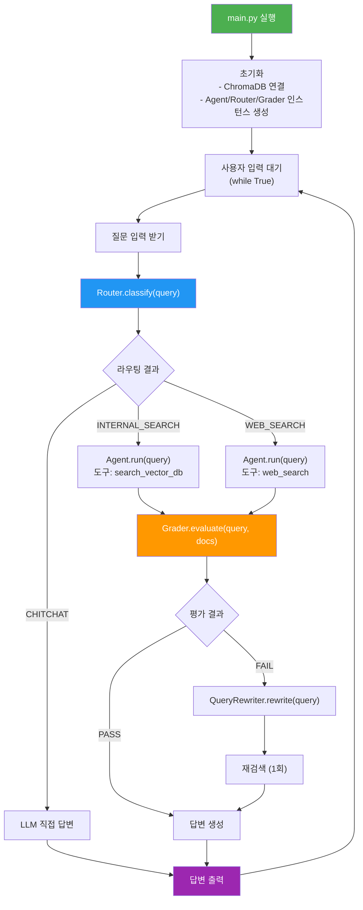
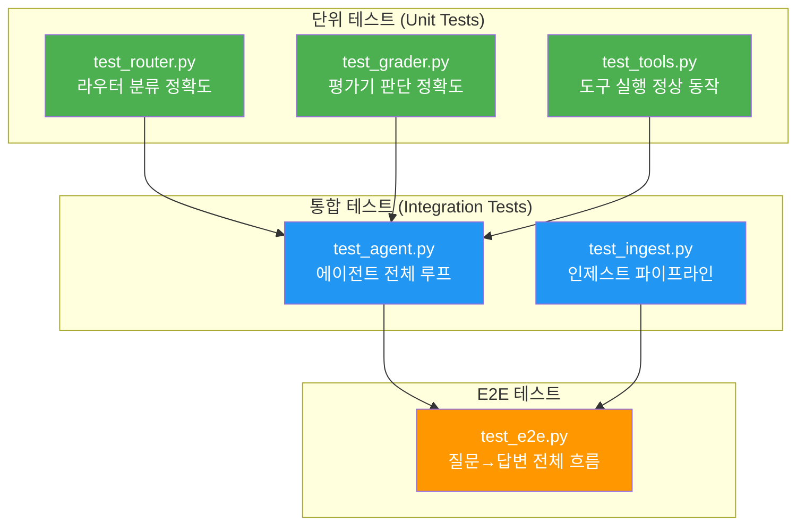

# Simple Agentic RAG - 구현 가이드

## 1. 개발 환경 설정

### 1.1 필수 패키지

```
# requirements.txt
anthropic>=0.39.0         # Claude API 클라이언트
chromadb>=0.5.0           # 벡터 데이터베이스
sentence-transformers>=3.0.0  # 임베딩 모델
python-dotenv>=1.0.0      # 환경 변수 관리
```

### 1.2 환경 변수

```bash
# .env.example
ANTHROPIC_API_KEY=your-api-key-here
TAVILY_API_KEY=your-tavily-key-here    # 웹 검색용 (선택)
CHROMA_PERSIST_DIR=./data/chroma       # ChromaDB 저장 경로
EMBEDDING_MODEL=all-MiniLM-L6-v2      # 임베딩 모델명
LLM_MODEL=claude-sonnet-4-20250514       # 사용할 Claude 모델
```

---

## 2. Phase 1 구현: 네이티브 Tool Calling

### 2.1 전체 흐름



### 2.2 핵심 코드 구조 - `agent.py`

```python
"""
Agent Core - Tool Calling 기반 에이전트 루프

핵심 로직:
1. 사용자 메시지 + 도구 정의를 Claude에게 전송
2. 응답에 tool_use가 있으면 해당 도구 실행
3. 실행 결과를 다시 Claude에게 전송 (반복)
4. text 응답이 나오면 최종 답변으로 반환
"""

import anthropic
from tools import TOOL_DEFINITIONS, execute_tool

MAX_TOOL_CALLS = 3  # 무한 루프 방지

def run_agent(user_query: str, conversation_history: list) -> str:
    client = anthropic.Anthropic()

    messages = conversation_history + [
        {"role": "user", "content": user_query}
    ]

    tool_call_count = 0

    while tool_call_count < MAX_TOOL_CALLS:
        response = client.messages.create(
            model="claude-sonnet-4-20250514",
            max_tokens=1024,
            system=SYSTEM_PROMPT,
            tools=TOOL_DEFINITIONS,
            messages=messages
        )

        # 응답에서 tool_use 블록 확인
        tool_use_blocks = [
            block for block in response.content
            if block.type == "tool_use"
        ]

        if not tool_use_blocks:
            # 도구 호출 없음 → 최종 텍스트 답변 반환
            return extract_text(response)

        # 도구 실행 및 결과 수집
        messages.append({"role": "assistant", "content": response.content})

        tool_results = []
        for tool_block in tool_use_blocks:
            result = execute_tool(tool_block.name, tool_block.input)
            tool_results.append({
                "type": "tool_result",
                "tool_use_id": tool_block.id,
                "content": result
            })

        messages.append({"role": "user", "content": tool_results})
        tool_call_count += 1

    return "죄송합니다. 답변을 생성하는 데 문제가 발생했습니다."
```

### 2.3 도구 정의 - `tools/vector_search.py`

```python
"""
벡터 DB 검색 도구

ChromaDB를 활용한 사내 문서 유사도 검색을 수행한다.
"""

import chromadb
from sentence_transformers import SentenceTransformer

# 도구 스키마 (Claude API 형식)
VECTOR_SEARCH_TOOL = {
    "name": "search_vector_db",
    "description": (
        "사내 문서 데이터베이스에서 관련 문서를 검색합니다. "
        "사내 정책, 가이드라인, 매뉴얼, 업무 절차 등에 대한 "
        "질문일 때 사용하세요."
    ),
    "input_schema": {
        "type": "object",
        "properties": {
            "query": {
                "type": "string",
                "description": "검색할 쿼리 문자열"
            },
            "top_k": {
                "type": "integer",
                "description": "반환할 최대 문서 수",
                "default": 3
            }
        },
        "required": ["query"]
    }
}

def search_vector_db(query: str, top_k: int = 3) -> list[dict]:
    embedder = SentenceTransformer("all-MiniLM-L6-v2")
    client = chromadb.PersistentClient(path="./data/chroma")
    collection = client.get_collection("documents")

    query_embedding = embedder.encode(query).tolist()

    results = collection.query(
        query_embeddings=[query_embedding],
        n_results=top_k
    )

    documents = []
    for i, doc in enumerate(results["documents"][0]):
        documents.append({
            "content": doc,
            "metadata": results["metadatas"][0][i],
            "distance": results["distances"][0][i]
        })

    return documents
```

### 2.4 도구 정의 - `tools/web_search.py`

```python
"""
웹 검색 도구

외부 웹 검색 API를 활용한 실시간 정보 검색을 수행한다.
"""

import os
import requests

WEB_SEARCH_TOOL = {
    "name": "web_search",
    "description": (
        "외부 웹에서 최신 정보를 검색합니다. "
        "실시간 데이터, 뉴스, 최신 기술 트렌드 등 "
        "사내 문서에 없는 정보가 필요할 때 사용하세요."
    ),
    "input_schema": {
        "type": "object",
        "properties": {
            "query": {
                "type": "string",
                "description": "검색할 쿼리 문자열"
            }
        },
        "required": ["query"]
    }
}

def web_search(query: str) -> list[dict]:
    api_key = os.getenv("TAVILY_API_KEY")

    response = requests.post(
        "https://api.tavily.com/search",
        json={
            "api_key": api_key,
            "query": query,
            "max_results": 3
        }
    )

    results = response.json().get("results", [])

    return [
        {
            "title": r["title"],
            "url": r["url"],
            "snippet": r["content"][:500]
        }
        for r in results
    ]
```

---

## 3. Phase 2 구현: Router 패턴

### 3.1 라우팅 흐름



### 3.2 Router 구현 - `router.py`

```python
"""
Router - 사용자 질문 의도 분류기

경량 LLM 호출로 질문을 3가지 카테고리로 분류한다.
"""

import anthropic
from prompts.router import ROUTER_PROMPT

class Router:
    VALID_ROUTES = {"INTERNAL_SEARCH", "WEB_SEARCH", "CHITCHAT"}

    def __init__(self):
        self.client = anthropic.Anthropic()

    def classify(self, query: str) -> str:
        """사용자 질문을 분류하여 라우팅 경로를 반환한다."""

        response = self.client.messages.create(
            model="claude-sonnet-4-20250514",
            max_tokens=50,
            system=ROUTER_PROMPT,
            messages=[
                {"role": "user", "content": query}
            ]
        )

        route = response.content[0].text.strip().upper()

        if route not in self.VALID_ROUTES:
            return "INTERNAL_SEARCH"  # 폴백

        return route
```

### 3.3 Router 프롬프트 - `prompts/router.py`

```python
ROUTER_PROMPT = """당신은 사용자 질문을 분류하는 라우터입니다.
사용자의 질문을 읽고 아래 세 가지 카테고리 중 하나만 정확히 출력하세요.

## 카테고리

- INTERNAL_SEARCH: 사내 문서, 정책, 가이드라인, 업무 절차, 회사 관련 질문
- WEB_SEARCH: 최신 뉴스, 실시간 데이터, 외부 기술 정보, 날씨, 주가 등
- CHITCHAT: 일반 인사, 잡담, 프로그래밍 기초 지식 등 검색이 필요 없는 질문

## 규칙

1. 반드시 위 세 단어 중 하나만 출력하세요.
2. 어떤 설명도 추가하지 마세요.
3. 확실하지 않으면 INTERNAL_SEARCH를 선택하세요.

## 출력 형식

카테고리_이름"""
```

---

## 4. Phase 3 구현: 단일 피드백 루프

### 4.1 CRAG 간소화 상태 머신



### 4.2 Grader 구현 - `grader.py`

```python
"""
Grader - 검색 결과 관련성 평가기

검색된 문서가 사용자 질문에 답하기 충분한지 이진 판단(PASS/FAIL)을 수행한다.
"""

import anthropic
from prompts.grader import GRADER_PROMPT

class Grader:
    def __init__(self):
        self.client = anthropic.Anthropic()

    def evaluate(self, query: str, documents: list[dict]) -> str:
        """검색 결과의 관련성을 평가한다."""

        docs_text = "\n\n---\n\n".join(
            f"[문서 {i+1}]\n{doc['content']}"
            for i, doc in enumerate(documents)
        )

        response = self.client.messages.create(
            model="claude-sonnet-4-20250514",
            max_tokens=10,
            system=GRADER_PROMPT,
            messages=[
                {
                    "role": "user",
                    "content": (
                        f"## 사용자 질문\n{query}\n\n"
                        f"## 검색된 문서\n{docs_text}"
                    )
                }
            ]
        )

        result = response.content[0].text.strip().upper()
        return result if result in ("PASS", "FAIL") else "PASS"
```

### 4.3 Query Rewriter 구현

```python
"""
Rewriter - 검색 쿼리 재작성기

Grader에서 FAIL 판정을 받은 경우, 원본 질문을 더 나은 검색 쿼리로 변환한다.
"""

import anthropic
from prompts.rewriter import REWRITER_PROMPT

class QueryRewriter:
    def __init__(self):
        self.client = anthropic.Anthropic()

    def rewrite(self, original_query: str) -> str:
        """원본 질문을 개선된 검색 쿼리로 재작성한다."""

        response = self.client.messages.create(
            model="claude-sonnet-4-20250514",
            max_tokens=200,
            system=REWRITER_PROMPT,
            messages=[
                {
                    "role": "user",
                    "content": f"원본 질문: {original_query}"
                }
            ]
        )

        return response.content[0].text.strip()
```

### 4.4 Grader 프롬프트 - `prompts/grader.py`

```python
GRADER_PROMPT = """당신은 검색 결과 평가자입니다.
사용자의 질문과 검색된 문서를 비교하여 문서가 질문에 답하기에 충분한지 판단합니다.

## 판단 기준

PASS: 검색된 문서 중 하나 이상이 질문의 핵심 키워드나 주제와 관련된 정보를 포함
FAIL: 검색된 문서가 질문과 전혀 무관하거나 필요한 정보가 전혀 없음

## 규칙

1. PASS 또는 FAIL 중 하나만 출력하세요.
2. 부분적으로라도 관련 있으면 PASS입니다.
3. 확신이 없으면 PASS를 선택하세요.

## 출력 형식

PASS 또는 FAIL"""
```

### 4.5 Rewriter 프롬프트 - `prompts/rewriter.py`

```python
REWRITER_PROMPT = """당신은 검색 쿼리 최적화 전문가입니다.
사용자의 원본 질문을 벡터 데이터베이스 검색에 더 적합한 형태로 재작성합니다.

## 재작성 규칙

1. 핵심 키워드를 추출하여 명확하게 표현
2. 불필요한 조사, 어미를 제거
3. 동의어나 관련 용어를 추가하여 검색 범위 확대
4. 원본 질문의 의도를 절대 변경하지 마세요
5. 재작성된 쿼리만 출력하세요 (설명 없이)

## 예시

원본: "회사에서 연차 쓰려면 어떻게 해야 해?"
재작성: "연차 휴가 신청 절차 방법 가이드"

원본: "새로 입사했는데 뭐부터 해야 하지?"
재작성: "신규 입사자 온보딩 체크리스트 절차"

## 출력 형식

재작성된 검색 쿼리 (한 줄)"""
```

---

## 5. 전체 통합: `main.py`

### 5.1 통합 실행 흐름



### 5.2 통합 코드 스케치

```python
"""
main.py - Simple Agentic RAG 진입점

Phase 1~3을 모두 통합한 최종 실행 파일이다.
"""

from agent import AgentCore
from router import Router
from grader import Grader, QueryRewriter
from config import Config

def main():
    config = Config()
    agent = AgentCore(config)
    router = Router()
    grader = Grader()
    rewriter = QueryRewriter()

    conversation_history = []

    print("Simple Agentic RAG Bot (종료: quit)")

    while True:
        query = input("\n[사용자] ").strip()
        if query.lower() in ("quit", "exit", "종료"):
            break

        # Phase 2: 라우팅
        route = router.classify(query)
        print(f"  [라우팅] {route}")

        if route == "CHITCHAT":
            answer = agent.direct_answer(query, conversation_history)
        else:
            # Phase 1: Tool Calling 기반 검색
            tool_filter = (
                "search_vector_db" if route == "INTERNAL_SEARCH"
                else "web_search"
            )
            answer, documents = agent.search_and_answer(
                query, conversation_history, tool_filter
            )

            # Phase 3: 검색 결과 평가
            if documents:
                grade = grader.evaluate(query, documents)
                print(f"  [평가] {grade}")

                if grade == "FAIL":
                    rewritten = rewriter.rewrite(query)
                    print(f"  [재작성] {rewritten}")
                    answer, _ = agent.search_and_answer(
                        rewritten, conversation_history, tool_filter
                    )

        print(f"\n[봇] {answer}")

        # 대화 히스토리 관리 (최근 10턴)
        conversation_history.append({"role": "user", "content": query})
        conversation_history.append({"role": "assistant", "content": answer})
        conversation_history = conversation_history[-20:]  # 10턴 = 20개 메시지

if __name__ == "__main__":
    main()
```

---

## 6. 문서 인제스트 구현 - `vectorstore/ingest.py`

### 6.1 인제스트 파이프라인


### 6.2 구현 코드

```python
"""
ingest.py - 문서 인제스트 파이프라인

data/documents/ 폴더의 파일을 읽어 ChromaDB에 벡터로 저장한다.
"""

import os
import glob
import chromadb
from sentence_transformers import SentenceTransformer

CHUNK_SIZE = 500
CHUNK_OVERLAP = 50

def chunk_text(text: str) -> list[str]:
    """텍스트를 고정 크기 청크로 분할한다."""
    chunks = []
    start = 0
    while start < len(text):
        end = start + CHUNK_SIZE
        chunk = text[start:end]
        chunks.append(chunk)
        start = end - CHUNK_OVERLAP
    return chunks

def ingest_documents(docs_dir: str = "./data/documents"):
    """문서 디렉토리의 모든 파일을 벡터 DB에 인제스트한다."""

    embedder = SentenceTransformer("all-MiniLM-L6-v2")
    client = chromadb.PersistentClient(path="./data/chroma")

    # 기존 컬렉션이 있으면 삭제 후 재생성
    try:
        client.delete_collection("documents")
    except ValueError:
        pass

    collection = client.create_collection(
        name="documents",
        metadata={"hnsw:space": "cosine"}
    )

    all_chunks = []
    all_metadatas = []
    all_ids = []

    # 지원 확장자
    extensions = ["*.txt", "*.md", "*.pdf"]

    for ext in extensions:
        for filepath in glob.glob(os.path.join(docs_dir, "**", ext), recursive=True):
            with open(filepath, "r", encoding="utf-8") as f:
                text = f.read()

            chunks = chunk_text(text)
            filename = os.path.basename(filepath)

            for i, chunk in enumerate(chunks):
                all_chunks.append(chunk)
                all_metadatas.append({
                    "source": filename,
                    "chunk_index": i
                })
                all_ids.append(f"{filename}_{i}")

    if not all_chunks:
        print("인제스트할 문서가 없습니다.")
        return

    # 배치 임베딩 및 저장
    embeddings = embedder.encode(all_chunks).tolist()

    collection.add(
        documents=all_chunks,
        embeddings=embeddings,
        metadatas=all_metadatas,
        ids=all_ids
    )

    print(f"총 {len(all_chunks)}개 청크를 인제스트했습니다.")

if __name__ == "__main__":
    ingest_documents()
```

---

## 7. 테스트 전략

### 7.1 테스트 구조



### 7.2 테스트 케이스 예시

| 테스트 | 입력 | 기대 결과 |
|--------|------|-----------|
| Router - 사내 문서 | "휴가 신청 방법 알려줘" | `INTERNAL_SEARCH` |
| Router - 웹 검색 | "오늘 서울 날씨 어때?" | `WEB_SEARCH` |
| Router - 잡담 | "안녕하세요!" | `CHITCHAT` |
| Grader - 관련 문서 | 질문과 관련된 문서 제공 | `PASS` |
| Grader - 무관 문서 | 질문과 무관한 문서 제공 | `FAIL` |
| Rewriter | "회사에서 연차 쓰려면?" | 핵심 키워드 포함 쿼리 |
| Agent - 도구 호출 | 사내 문서 질문 | `search_vector_db` 호출됨 |
| Agent - 직접 답변 | "1+1은?" | 도구 미호출, 직접 답변 |

---

## 8. 구현 체크리스트

### Phase 1

- [ ] 프로젝트 초기 설정 (`requirements.txt`, `.env`, `.gitignore`)
- [ ] `config.py` - 설정 관리 모듈
- [ ] `tools/vector_search.py` - 벡터 검색 도구
- [ ] `tools/web_search.py` - 웹 검색 도구
- [ ] `agent.py` - 에이전트 코어 (Tool Calling 루프)
- [ ] `vectorstore/ingest.py` - 문서 인제스트
- [ ] `main.py` - 기본 CLI 인터페이스
- [ ] Phase 1 테스트 작성 및 통과

### Phase 2

- [ ] `prompts/router.py` - 라우터 프롬프트
- [ ] `router.py` - 라우터 구현
- [ ] `main.py` 에 라우터 통합
- [ ] Phase 2 테스트 작성 및 통과

### Phase 3

- [ ] `prompts/grader.py` - 평가 프롬프트
- [ ] `prompts/rewriter.py` - 재작성 프롬프트
- [ ] `grader.py` - 평가기 및 재작성기 구현
- [ ] `main.py` 에 피드백 루프 통합
- [ ] Phase 3 테스트 작성 및 통과
- [ ] E2E 테스트 작성 및 통과
