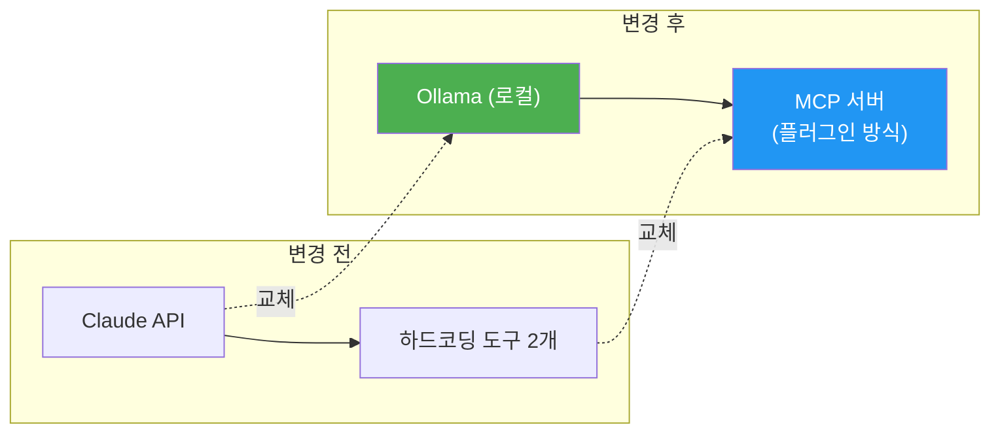
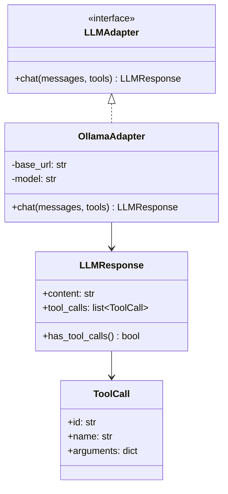
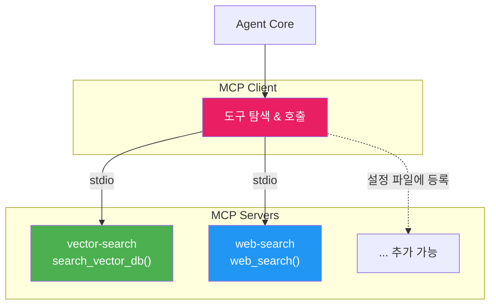
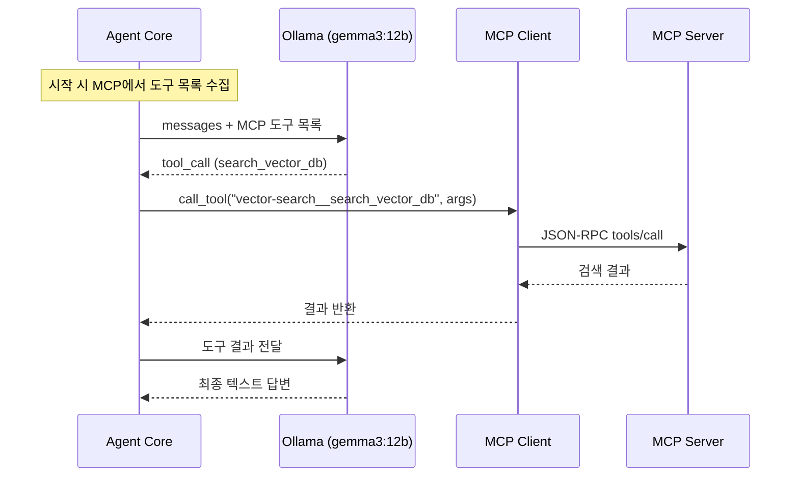

# Simple Agentic RAG - Ollama + MCP 통합 설계

## 1. 변경 개요

기존 파이프라인(Router → Planner → Agent → Grader → HITL)은 **그대로 유지**한다. 바뀌는 것은 두 가지뿐이다.

| 항목 | 기존 | 변경 |
|------|------|------|
| **LLM 백엔드** | Claude API (클라우드) | Ollama gemma3:12b (로컬) |
| **도구 제공 방식** | `tools/` 폴더에 하드코딩 | MCP 서버로 플러그인 방식 확장 |



파이프라인 자체는 건드리지 않는다. Agent Core의 Tool Calling 루프에서 **도구를 어디서 가져오느냐**만 바뀐다.

---

## 2. Ollama 로컬 LLM

### 2.1 왜 gemma3:12b인가

| 항목 | gemma3:12b |
|------|-----------|
| **비용** | 무료 (로컬) |
| **Tool Calling** | Ollama 네이티브 지원 |
| **한국어** | 양호 (12B 규모) |
| **VRAM** | ~8GB |
| **컨텍스트** | 128K |

### 2.2 LLM Adapter (추상화 레이어)

나중에 모델을 바꿀 수 있도록 얇은 추상화 레이어를 둔다. `.env`에서 모델명만 바꾸면 교체된다.



### 2.3 구현 코드 - `llm_adapter.py`

```python
"""
LLM Adapter - Ollama 래퍼

Ollama의 OpenAI 호환 API를 통해 Tool Calling을 수행한다.
"""

import json
import requests
from dataclasses import dataclass, field


@dataclass
class ToolCall:
    id: str
    name: str
    arguments: dict


@dataclass
class LLMResponse:
    content: str = ""
    tool_calls: list[ToolCall] = field(default_factory=list)

    def has_tool_calls(self) -> bool:
        return len(self.tool_calls) > 0


class OllamaAdapter:
    def __init__(self, model: str = "gemma3:12b", base_url: str = "http://localhost:11434"):
        self.model = model
        self.base_url = base_url

    def chat(self, messages: list, tools: list | None = None) -> LLMResponse:
        payload = {"model": self.model, "messages": messages, "stream": False}

        if tools:
            payload["tools"] = [
                {"type": "function", "function": {
                    "name": t["name"],
                    "description": t["description"],
                    "parameters": t["parameters"]
                }}
                for t in tools
            ]

        resp = requests.post(f"{self.base_url}/api/chat", json=payload, timeout=120)
        resp.raise_for_status()
        msg = resp.json().get("message", {})

        tool_calls = []
        for i, tc in enumerate(msg.get("tool_calls", [])):
            fn = tc.get("function", {})
            args = fn.get("arguments", {})
            if isinstance(args, str):
                args = json.loads(args)
            tool_calls.append(ToolCall(id=f"call_{i}", name=fn.get("name", ""), arguments=args))

        return LLMResponse(content=msg.get("content", ""), tool_calls=tool_calls)
```

### 2.4 기존 코드 변경 포인트

기존의 `anthropic.Anthropic().messages.create(...)` 호출을 `OllamaAdapter.chat(...)` 으로 교체하면 된다. 시그니처가 비슷하므로 변경량이 적다.

```python
# 기존 (Claude)
client = anthropic.Anthropic()
response = client.messages.create(model="claude-sonnet-4-20250514", messages=..., tools=...)

# 변경 (Ollama)
llm = OllamaAdapter(model="gemma3:12b")
response = llm.chat(messages=..., tools=...)
```

### 2.5 모델 교체

`.env` 파일에서 `LLM_MODEL`만 바꾸면 된다:

| 모델 | VRAM | 한국어 | 권장 |
|------|------|--------|------|
| `gemma3:12b` | ~8GB | 양호 | 기본값 |
| `qwen2.5:14b` | ~10GB | 우수 | 한국어 우선 시 |
| `gemma3:27b` | ~18GB | 우수 | GPU 여유 있을 때 |

---

## 3. MCP 도구 시스템

### 3.1 개념

MCP(Model Context Protocol)를 쓰면 도구를 **플러그인처럼 추가/제거**할 수 있다. 코드를 고치지 않고 설정 파일에 서버만 등록하면 된다.



### 3.2 설정 파일 - `mcp_config.json`

```json
{
  "mcpServers": {
    "vector-search": {
      "command": "python",
      "args": ["src/mcp_servers/vector_search_server.py"]
    },
    "web-search": {
      "command": "python",
      "args": ["src/mcp_servers/web_search_server.py"]
    }
  }
}
```

도구를 추가하려면 이 파일에 한 줄 추가:

```json
{
  "mcpServers": {
    "vector-search": { "..." : "..." },
    "web-search": { "..." : "..." },
    "slack": {
      "command": "npx",
      "args": ["-y", "@anthropic/mcp-slack"],
      "env": { "SLACK_TOKEN": "${SLACK_TOKEN}" }
    }
  }
}
```

### 3.3 MCP Client 구현 - `mcp_client.py`

```python
"""
MCP Client - MCP 서버 연결 및 도구 관리

시작 시 mcp_config.json의 서버에 연결하여 도구 목록을 수집하고,
Agent Core가 도구를 호출할 때 해당 MCP 서버로 요청을 중계한다.
"""

import json
import subprocess
from dataclasses import dataclass
from pathlib import Path


@dataclass
class MCPTool:
    server_name: str
    name: str
    description: str
    parameters: dict

    def to_llm_tool(self) -> dict:
        return {
            "name": f"{self.server_name}__{self.name}",
            "description": self.description,
            "parameters": self.parameters
        }


class MCPClient:
    def __init__(self, config_path: str = "mcp_config.json"):
        self.config_path = Path(config_path)
        self.servers = {}   # name → subprocess
        self.tools = {}     # full_name → MCPTool

    def connect_all(self):
        if not self.config_path.exists():
            return

        config = json.loads(self.config_path.read_text())
        for name, cfg in config.get("mcpServers", {}).items():
            try:
                proc = subprocess.Popen(
                    [cfg["command"]] + cfg.get("args", []),
                    stdin=subprocess.PIPE, stdout=subprocess.PIPE,
                    stderr=subprocess.PIPE
                )
                self.servers[name] = proc

                # 초기화
                self._send(proc, "initialize", {
                    "protocolVersion": "2024-11-05",
                    "capabilities": {},
                    "clientInfo": {"name": "agentic-rag-bot"}
                })

                # 도구 수집
                result = self._send(proc, "tools/list", {})
                for t in result.get("tools", []):
                    full_name = f"{name}__{t['name']}"
                    self.tools[full_name] = MCPTool(
                        server_name=name,
                        name=t["name"],
                        description=t.get("description", ""),
                        parameters=t.get("inputSchema", {})
                    )
            except Exception as e:
                print(f"  [MCP] {name} 연결 실패: {e}")

    def get_tools_for_llm(self) -> list[dict]:
        return [t.to_llm_tool() for t in self.tools.values()]

    def call_tool(self, full_name: str, arguments: dict) -> str:
        tool = self.tools.get(full_name)
        if not tool:
            return f"도구 '{full_name}'을 찾을 수 없습니다."

        proc = self.servers.get(tool.server_name)
        result = self._send(proc, "tools/call", {
            "name": tool.name, "arguments": arguments
        })
        return json.dumps(result, ensure_ascii=False)

    def _send(self, proc, method: str, params: dict) -> dict:
        req = {"jsonrpc": "2.0", "id": 1, "method": method, "params": params}
        proc.stdin.write((json.dumps(req) + "\n").encode())
        proc.stdin.flush()
        line = proc.stdout.readline().decode()
        return json.loads(line).get("result", {})

    def disconnect_all(self):
        for proc in self.servers.values():
            proc.terminate()
```

### 3.4 내장 MCP 서버 예시 - `mcp_servers/vector_search_server.py`

```python
"""Vector Search MCP Server - 벡터 DB 검색 도구를 MCP로 제공"""

import json, sys
import chromadb
from src.embedding import OllamaEmbedder

embedder = OllamaEmbedder(model="bona/bge-m3-korean:latest")
chroma = chromadb.PersistentClient(path="./data/chroma")

TOOLS = [{
    "name": "search_vector_db",
    "description": "사내 문서 데이터베이스에서 관련 문서를 검색합니다.",
    "inputSchema": {
        "type": "object",
        "properties": {
            "query": {"type": "string", "description": "검색 쿼리"},
            "top_k": {"type": "integer", "default": 3}
        },
        "required": ["query"]
    }
}]

def search(query, top_k=3):
    col = chroma.get_collection("documents")
    results = col.query(query_embeddings=[embedder.encode(query).tolist()], n_results=top_k)
    docs = [{"content": d, "metadata": results["metadatas"][0][i]}
            for i, d in enumerate(results["documents"][0])]
    return {"content": [{"type": "text", "text": json.dumps(docs, ensure_ascii=False)}]}

if __name__ == "__main__":
    for line in sys.stdin:
        req = json.loads(line.strip())
        m = req.get("method", "")
        if m == "initialize":
            r = {"protocolVersion": "2024-11-05", "capabilities": {"tools": {}},
                 "serverInfo": {"name": "vector-search"}}
        elif m == "tools/list":
            r = {"tools": TOOLS}
        elif m == "tools/call":
            p = req["params"]
            r = search(p["arguments"]["query"], p["arguments"].get("top_k", 3))
        else:
            r = {}
        sys.stdout.write(json.dumps({"jsonrpc": "2.0", "id": req.get("id"), "result": r}) + "\n")
        sys.stdout.flush()
```

---

## 4. Agent Core 변경점

기존 Agent Core의 Tool Calling 루프는 **거의 그대로** 유지된다. 바뀌는 것:

1. `anthropic.Anthropic()` → `OllamaAdapter`
2. 하드코딩 도구 정의 → `mcp.get_tools_for_llm()`
3. 하드코딩 도구 실행 → `mcp.call_tool(name, args)`



### 4.1 변경된 agent.py 핵심 부분

```python
"""Agent Core - Ollama + MCP 기반 Tool Calling 루프"""

from llm_adapter import OllamaAdapter
from mcp_client import MCPClient

MAX_TOOL_CALLS = 5

class AgentCore:
    def __init__(self, llm: OllamaAdapter, mcp: MCPClient, system_prompt: str):
        self.llm = llm
        self.mcp = mcp
        self.system_prompt = system_prompt

    def run(self, messages: list) -> str:
        tools = self.mcp.get_tools_for_llm()
        full_messages = [{"role": "system", "content": self.system_prompt}] + messages

        for _ in range(MAX_TOOL_CALLS):
            response = self.llm.chat(full_messages, tools=tools)

            if not response.has_tool_calls():
                return response.content

            # 도구 호출 → 결과 수집 → 다시 LLM에게 전달
            full_messages.append({
                "role": "assistant",
                "content": response.content,
                "tool_calls": [{"id": tc.id, "type": "function",
                    "function": {"name": tc.name, "arguments": tc.arguments}}
                    for tc in response.tool_calls]
            })

            for tc in response.tool_calls:
                result = self.mcp.call_tool(tc.name, tc.arguments)
                full_messages.append({
                    "role": "tool", "tool_call_id": tc.id, "content": result
                })

        return "답변 생성에 실패했습니다."
```

---

## 5. "알아서 처리"하는 비결: 시스템 프롬프트

복잡한 Orchestrator를 만드는 것이 아니라, **좋은 시스템 프롬프트**로 LLM이 똑똑하게 도구를 선택하도록 만든다.

```python
SYSTEM_PROMPT = """당신은 사내 업무를 도와주는 AI 어시스턴트입니다.

## 사용 가능한 도구
{tools}

## 행동 규칙

1. 사용자의 질문을 잘 이해하고, 필요한 경우에만 도구를 사용하세요.
2. 사내 문서/정책/규정이 궁금하면 search_vector_db를 호출하세요.
3. 최신 뉴스/외부 정보가 필요하면 web_search를 호출하세요.
4. 일반적인 인사나 잡담에는 도구 없이 바로 답변하세요.
5. 검색 결과가 부족하면 키워드를 바꿔서 한 번 더 검색하세요.
6. 모르는 건 모른다고 솔직하게 말하세요.
7. 답변은 한국어로 간결하고 친절하게 작성하세요.

## 중요
- 도구 호출 결과를 그대로 보여주지 말고, 사용자가 이해하기 쉽게 정리하세요.
- 대화 맥락을 기억하여 이전 질문과 연결하여 답변하세요."""
```

이 프롬프트만 잘 짜면 LLM이 Router/Planner 역할까지 내재화하여 동작한다. 별도 Router LLM 호출 없이 **한 번의 LLM 호출로 도구 호출 여부, 쿼리 최적화, 답변 생성**을 모두 처리할 수 있다.

### 5.1 단순 모드 vs 상세 모드

| 모드 | 파이프라인 | LLM 호출 수 | 정확도 | 속도 |
|------|-----------|------------|--------|------|
| **단순 모드** | Agent Core만 (프롬프트로 모든 것 처리) | 1~2회 | 양호 | 빠름 |
| **상세 모드** | Router → Planner → Agent → Grader → HITL | 3~5회 | 우수 | 느림 |

권장: **단순 모드로 시작**하고, gemma3:12b의 Tool Calling 정확도가 부족할 때만 상세 모드의 개별 컴포넌트를 활성화한다.

---

## 6. 변경된 프로젝트 구조

```
agentic-rag-bot/
├── src/
│   ├── main.py                      # 진입점
│   ├── agent.py                     # Agent Core (Tool Calling 루프)
│   ├── llm_adapter.py               # [신규] Ollama 래퍼
│   ├── mcp_client.py                # [신규] MCP 클라이언트
│   ├── router.py                    # Router (선택적 - 상세 모드)
│   ├── planner.py                   # Planner (선택적 - 상세 모드)
│   ├── grader.py                    # Grader (선택적 - 상세 모드)
│   ├── hitl.py                      # HITL
│   ├── mcp_servers/                 # [신규] 내장 MCP 서버
│   │   ├── vector_search_server.py
│   │   └── web_search_server.py
│   ├── prompts/
│   │   └── system.py                # 시스템 프롬프트
│   ├── vectorstore/
│   │   └── ingest.py
│   └── config.py
├── mcp_config.json                  # [신규] MCP 서버 설정
├── data/
├── tests/
├── .env.example
└── requirements.txt
```

### 6.1 .env.example

```bash
# Ollama
OLLAMA_URL=http://localhost:11434
LLM_MODEL=gemma3:12b

# MCP
MCP_CONFIG_PATH=mcp_config.json

# 벡터 DB
CHROMA_PERSIST_DIR=./data/chroma
EMBEDDING_MODEL=bona/bge-m3-korean:latest

# HITL
HITL_MODE=auto
```

### 6.2 requirements.txt

```
requests>=2.31.0
chromadb>=0.5.0
numpy>=1.24.0
python-dotenv>=1.0.0
```

---

## 7. 도구 추가 예시 (MCP 확장)

새 도구를 추가하는 전체 과정:


코드 변경 **0줄**. 설정 파일만 수정하면 된다.
