# Simple Agentic RAG - Query Planner 설계 문서

## 1. Query Planner가 필요한 이유

### 1.1 기존 설계의 한계

기존 흐름: `Router → 검색 → Grader → (실패 시) Rewriter → 재검색`

이 구조에서는 **사용자의 원본 질문이 그대로 검색 쿼리로 사용**된다. 문제는 자연어 질문이 벡터 검색에 최적화된 형태가 아니라는 점이다.

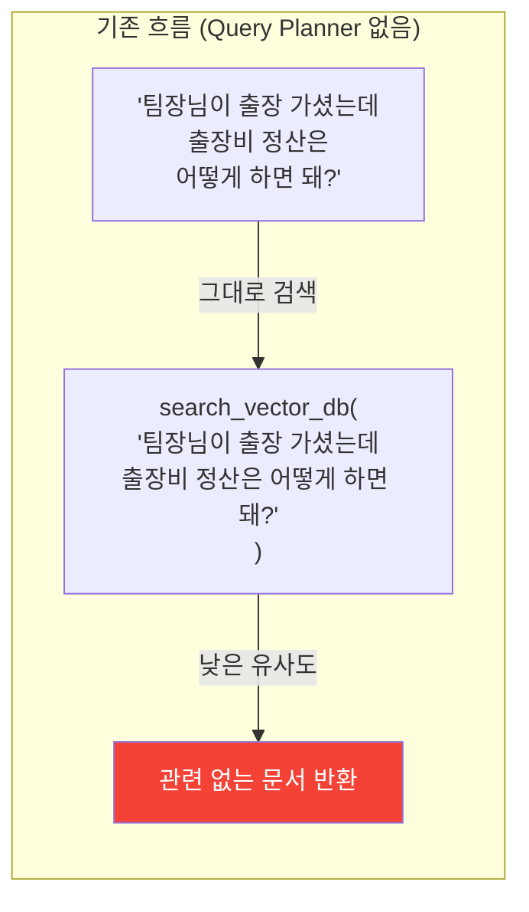

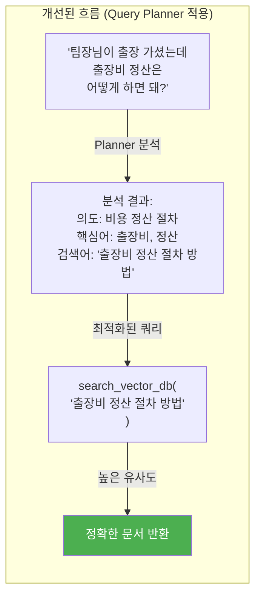

### 1.2 Query Planner의 역할

| 역할 | 설명 | 예시 |
|------|------|------|
| **질의 해석 (Query Understanding)** | 사용자 질문의 진짜 의도를 파악 | "요즘 핫한 거" → 기술 트렌드 질문 |
| **핵심어 추출 (Keyword Extraction)** | 검색에 유효한 핵심 키워드 추출 | "팀장님이 출장 가셨는데..." → `출장비`, `정산` |
| **쿼리 재구성 (Query Reformulation)** | 벡터 검색에 최적화된 쿼리로 변환 | 구어체 → 키워드 중심 명사구 |
| **쿼리 분해 (Query Decomposition)** | 복합 질문을 단일 질문들로 분해 | "휴가 규정이랑 출장비 정산 둘 다 알려줘" → 2개 쿼리 |
| **맥락 보강 (Context Enrichment)** | 대화 히스토리에서 대명사/생략어 해소 | "그거 다시 알려줘" → 이전 질문 맥락 반영 |

---

## 2. 시스템 내 위치

### 2.1 수정된 전체 파이프라인

Query Planner는 **Router 이후, 검색 이전**에 위치한다. Router가 "검색이 필요하다"고 판단한 질문에 대해서만 동작한다.

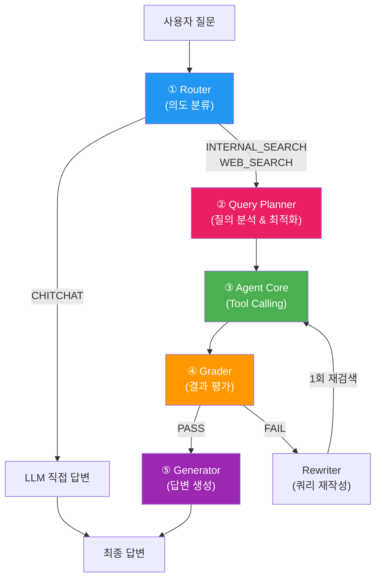

### 2.2 Phase 진화에서의 위치

Query Planner는 **Phase 2.5** (Router와 Feedback Loop 사이)로 도입한다. Router가 안정화된 후, Grader 도입 전에 추가하면 1차 검색 적중률을 높여 Grader의 부담을 줄일 수 있다.

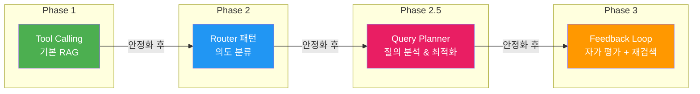

---

## 3. Query Planner 상세 설계

### 3.1 입출력 정의

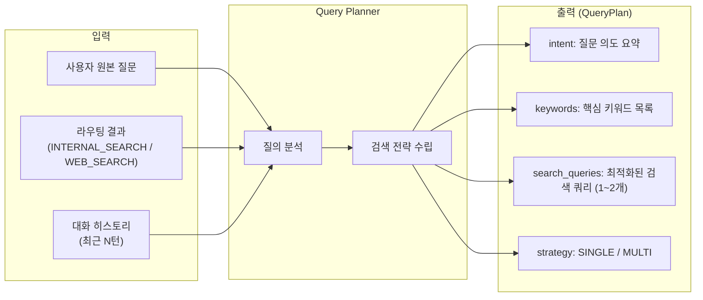

### 3.2 출력 스키마 (QueryPlan)

```json
{
  "intent": "출장비 정산 절차를 알고 싶음",
  "keywords": ["출장비", "정산", "절차", "경비"],
  "search_queries": [
    "출장비 정산 절차 방법 가이드",
    "출장 경비 처리 규정"
  ],
  "strategy": "SINGLE"
}
```

| 필드 | 타입 | 설명 |
|------|------|------|
| `intent` | `str` | 질문의 핵심 의도를 한 문장으로 요약 |
| `keywords` | `list[str]` | 검색에 활용할 핵심 키워드 (3~5개) |
| `search_queries` | `list[str]` | 최적화된 검색 쿼리 (최대 2개) |
| `strategy` | `str` | `SINGLE` (단일 쿼리 검색) 또는 `MULTI` (복수 쿼리 병합) |

### 3.3 처리 흐름 상세

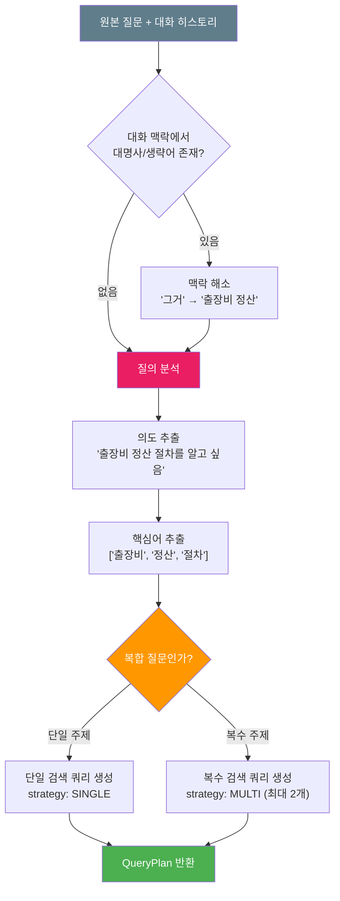

---

## 4. 핵심 기능 상세

### 4.1 대화 맥락 해소 (Coreference Resolution)

대화형 RAG에서 가장 흔한 문제인 "대명사/생략어" 문제를 해결한다.

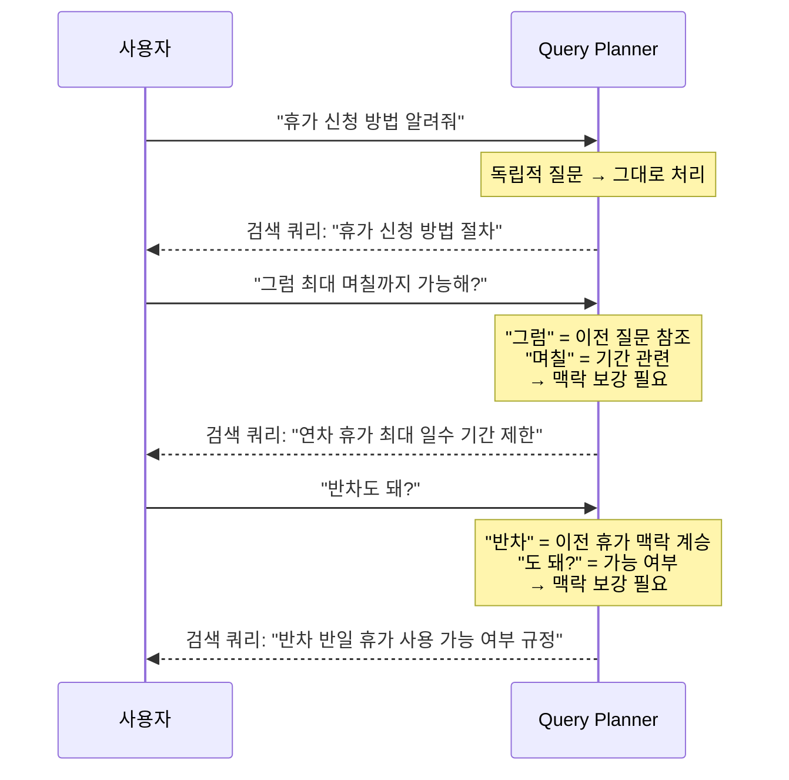

### 4.2 복합 질문 분해 (Query Decomposition)

하나의 질문에 여러 주제가 포함된 경우, 개별 검색 쿼리로 분해한다.

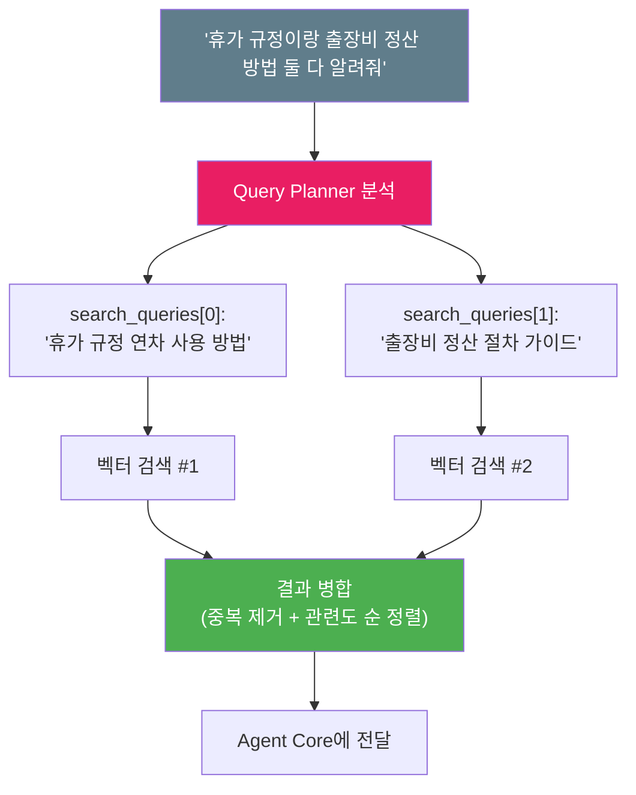

**분해 제한 규칙:**
- 최대 **2개** 쿼리로만 분해 (비용/속도 제어)
- 단일 주제 질문은 분해하지 않음 (불필요한 API 호출 방지)

### 4.3 쿼리 최적화 변환 규칙

| 원본 패턴 | 변환 규칙 | 예시 |
|-----------|-----------|------|
| **구어체** | 조사/어미 제거, 명사구 중심으로 변환 | "어떻게 하면 돼?" → "방법 절차 가이드" |
| **대명사** | 대화 히스토리에서 실체 참조 복원 | "그거" → 이전 질문의 핵심 주제 |
| **생략어** | 문맥에서 빠진 주어/목적어 보충 | "최대 며칠?" → "연차 휴가 최대 사용 일수" |
| **부정형** | 긍정형 검색어로 변환 | "안 되는 경우?" → "제한 사항 조건 예외" |
| **모호한 표현** | 구체적 키워드로 확장 | "요즘 핫한 거" → "최신 기술 트렌드 2024" |
| **복합 질문** | 핵심 주제별로 분리 | "A랑 B 둘 다" → [쿼리A, 쿼리B] |

---

## 5. 구현 설계

### 5.1 클래스 설계

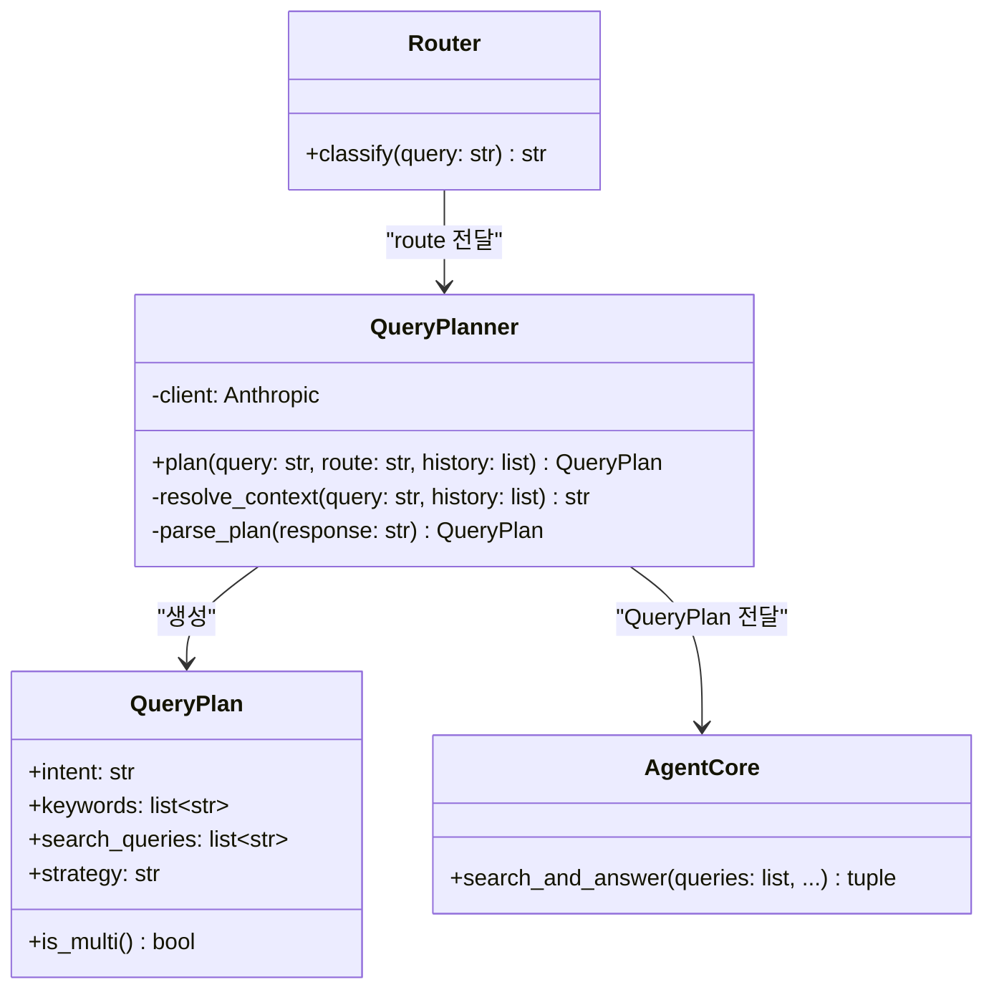

### 5.2 구현 코드 - `planner.py`

```python
"""
Query Planner - 검색 전 질의 분석 및 최적화

Router 이후, 검색 이전에 실행되어
사용자 질문을 벡터 검색에 최적화된 쿼리로 변환한다.
"""

import json
import anthropic
from dataclasses import dataclass
from prompts.planner import PLANNER_PROMPT

@dataclass
class QueryPlan:
    intent: str
    keywords: list[str]
    search_queries: list[str]
    strategy: str  # "SINGLE" or "MULTI"

    def is_multi(self) -> bool:
        return self.strategy == "MULTI" and len(self.search_queries) > 1


class QueryPlanner:
    def __init__(self):
        self.client = anthropic.Anthropic()

    def plan(
        self,
        query: str,
        route: str,
        conversation_history: list | None = None
    ) -> QueryPlan:
        """사용자 질문을 분석하여 최적화된 검색 계획을 생성한다."""

        # 대화 히스토리에서 최근 3턴만 추출
        recent_history = ""
        if conversation_history:
            recent = conversation_history[-6:]  # 3턴 = 6개 메시지
            for msg in recent:
                role = "사용자" if msg["role"] == "user" else "봇"
                content = msg["content"]
                if isinstance(content, str):
                    recent_history += f"[{role}] {content}\n"

        user_message = f"""## 라우팅 결과
{route}

## 대화 히스토리
{recent_history if recent_history else "(없음)"}

## 현재 질문
{query}"""

        response = self.client.messages.create(
            model="claude-sonnet-4-20250514",
            max_tokens=300,
            system=PLANNER_PROMPT,
            messages=[
                {"role": "user", "content": user_message}
            ]
        )

        return self._parse_plan(response.content[0].text, query)

    def _parse_plan(self, response_text: str, original_query: str) -> QueryPlan:
        """LLM 응답을 QueryPlan으로 파싱한다. 실패 시 원본 쿼리 폴백."""
        try:
            # JSON 블록 추출
            text = response_text.strip()
            if "```json" in text:
                text = text.split("```json")[1].split("```")[0]
            elif "```" in text:
                text = text.split("```")[1].split("```")[0]

            data = json.loads(text.strip())

            return QueryPlan(
                intent=data.get("intent", original_query),
                keywords=data.get("keywords", []),
                search_queries=data.get("search_queries", [original_query]),
                strategy=data.get("strategy", "SINGLE")
            )
        except (json.JSONDecodeError, KeyError, IndexError):
            # 파싱 실패 시 원본 쿼리를 그대로 사용
            return QueryPlan(
                intent=original_query,
                keywords=[],
                search_queries=[original_query],
                strategy="SINGLE"
            )
```

### 5.3 Planner 프롬프트 - `prompts/planner.py`

```python
PLANNER_PROMPT = """당신은 검색 쿼리 최적화 전문가입니다.
사용자의 질문을 분석하여 벡터 데이터베이스 검색에 최적화된 검색 계획을 생성합니다.

## 수행할 작업

1. **맥락 해소**: 대화 히스토리를 참고하여 대명사("그거", "이것")나 생략된 주어를 복원
2. **의도 파악**: 사용자가 실제로 알고 싶은 것을 한 문장으로 요약
3. **핵심어 추출**: 검색에 유효한 핵심 키워드 3~5개 추출
4. **쿼리 생성**: 벡터 검색에 최적화된 검색 쿼리 생성
5. **전략 결정**: 단일 주제면 SINGLE, 복수 주제면 MULTI

## 쿼리 최적화 규칙

- 구어체 조사/어미를 제거하고 명사구 중심으로 변환
- 동의어/관련 용어를 추가하여 검색 범위 확대
- 질문의 의도를 절대 변경하지 말 것
- 복합 질문은 최대 2개 쿼리로만 분해
- 단일 주제 질문은 반드시 strategy를 SINGLE로

## 출력 형식 (JSON만 출력)

```json
{
  "intent": "질문 의도 요약 (한 문장)",
  "keywords": ["핵심어1", "핵심어2", "핵심어3"],
  "search_queries": ["최적화된 검색 쿼리 1"],
  "strategy": "SINGLE"
}
```

## 예시

### 입력
대화 히스토리: [사용자] 휴가 신청 방법 알려줘
현재 질문: "그럼 최대 며칠까지 돼?"

### 출력
```json
{
  "intent": "연차 휴가의 최대 사용 가능 일수를 알고 싶음",
  "keywords": ["연차", "휴가", "최대 일수", "사용 기간", "제한"],
  "search_queries": ["연차 휴가 최대 사용 일수 기간 제한 규정"],
  "strategy": "SINGLE"
}
```

### 입력
현재 질문: "휴가 규정이랑 출장비 정산 방법 둘 다 알려줘"

### 출력
```json
{
  "intent": "휴가 규정과 출장비 정산 방법 두 가지를 알고 싶음",
  "keywords": ["휴가", "규정", "출장비", "정산", "절차"],
  "search_queries": ["휴가 규정 연차 사용 방법", "출장비 경비 정산 절차 가이드"],
  "strategy": "MULTI"
}
```"""
```

---

## 6. 통합 흐름 (main.py 수정)

### 6.1 수정된 실행 흐름

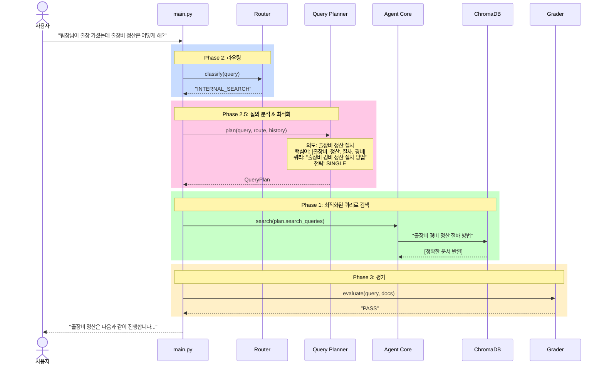

### 6.2 MULTI 전략 시 실행 흐름

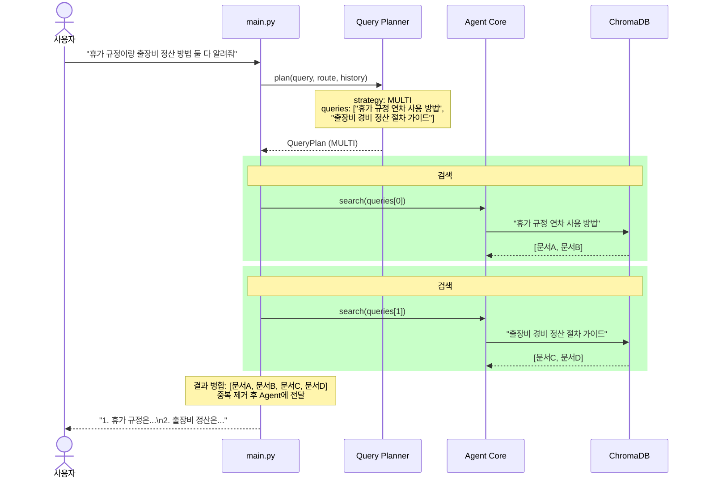

### 6.3 통합 코드 수정 (main.py에 추가)

```python
# main.py 수정 부분

from planner import QueryPlanner

# 초기화
planner = QueryPlanner()

# 기존 라우팅 이후에 추가
if route in ("INTERNAL_SEARCH", "WEB_SEARCH"):
    # Phase 2.5: 질의 분석 & 최적화
    plan = planner.plan(query, route, conversation_history)
    print(f"  [플래닝] 의도: {plan.intent}")
    print(f"  [플래닝] 검색어: {plan.search_queries}")

    tool_filter = (
        "search_vector_db" if route == "INTERNAL_SEARCH"
        else "web_search"
    )

    if plan.is_multi():
        # 복수 쿼리: 각각 검색 후 결과 병합
        all_documents = []
        for sq in plan.search_queries:
            _, docs = agent.search_and_answer(
                sq, conversation_history, tool_filter
            )
            all_documents.extend(docs)
        # 중복 제거
        seen = set()
        documents = []
        for doc in all_documents:
            key = doc["content"][:100]
            if key not in seen:
                seen.add(key)
                documents.append(doc)
    else:
        # 단일 쿼리: 최적화된 쿼리로 검색
        _, documents = agent.search_and_answer(
            plan.search_queries[0], conversation_history, tool_filter
        )

    # Phase 3: Grader 평가 (기존과 동일)
    if documents:
        grade = grader.evaluate(query, documents)  # 원본 질문으로 평가
        # ...
```

---

## 7. Query Planner vs Rewriter 역할 비교

둘 다 "쿼리를 변환"하지만, 동작 시점과 목적이 다르다.

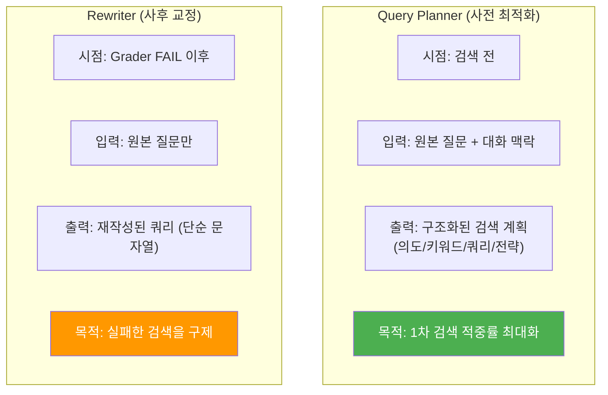

| 구분 | Query Planner | Rewriter |
|------|---------------|----------|
| **실행 시점** | 검색 **전** (선제적) | Grader FAIL **후** (반응적) |
| **입력** | 원본 질문 + 대화 히스토리 + 라우팅 결과 | 원본 질문만 |
| **출력** | 구조화된 QueryPlan (JSON) | 단순 문자열 (재작성 쿼리) |
| **복합 질문 처리** | 가능 (MULTI 전략) | 불가능 |
| **대화 맥락 활용** | 대명사/생략어 해소 | 미지원 |
| **API 비용** | 매 검색 질문마다 1회 | Grader FAIL 시에만 1회 |

### Planner 도입 후 Rewriter 역할 변화

Planner 도입 후에도 Rewriter는 유지하되, 역할이 축소된다:

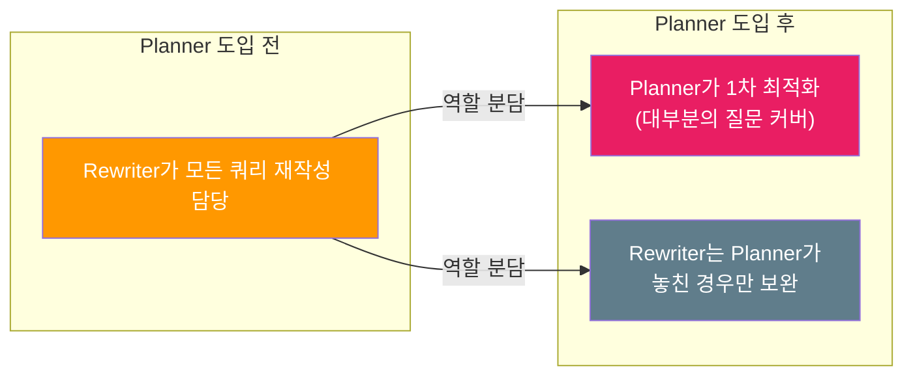

---

## 8. 성능 영향 분석

### 8.1 API 호출 변화

| 시나리오 | Planner 없음 | Planner 있음 | 차이 |
|----------|-------------|-------------|------|
| CHITCHAT | 2회 | 2회 | 변화 없음 |
| 검색 성공 (1차) | 3회 | **4회** | +1회 (Planner) |
| 검색 실패 → 재검색 | 5회 | **4회** | -1회 (재검색 감소) |
| 복합 질문 | 3회 (부정확) | **5회** | +2회 (정확도 향상) |

### 8.2 기대 효과

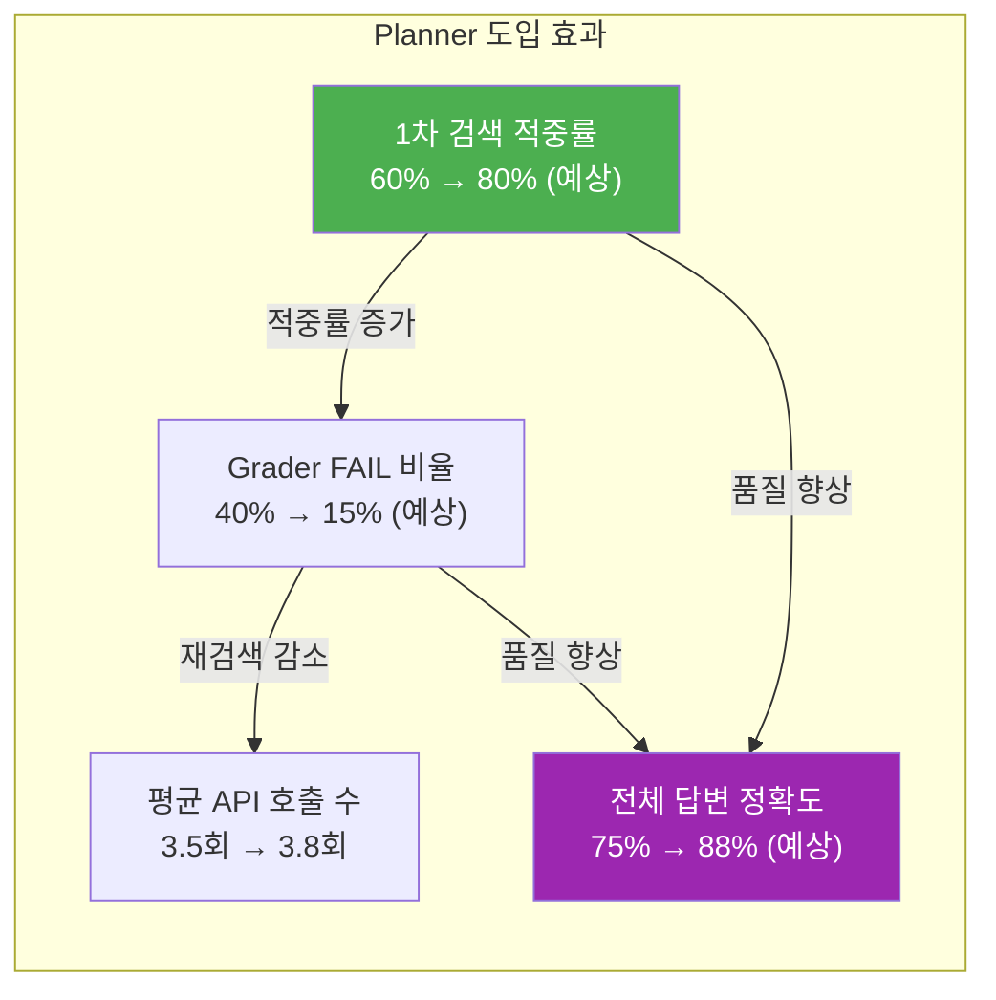

### 8.3 트레이드오프

| 장점 | 단점 |
|------|------|
| 1차 검색 적중률 대폭 향상 | 검색 질문마다 API 1회 추가 비용 |
| 대화형 맥락 연속성 보장 | 응답 지연 ~200ms 추가 |
| 복합 질문 처리 가능 | 코드 복잡도 소폭 증가 |
| Grader FAIL → Rewrite 빈도 감소 | Planner 자체 파싱 오류 가능성 |

**결론**: API 호출 1회 추가 비용 대비, 재검색 횟수 감소와 답변 품질 향상 효과가 더 크므로 **도입 가치가 충분하다.**
