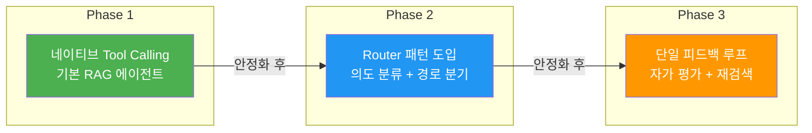
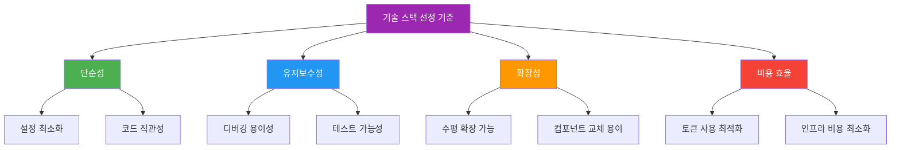

# Simple Agentic RAG - 구현 전략 문서

## 1. 프로젝트 개요

### 1.1 목적

복잡한 멀티 에이전트 프레임워크를 배제하고, **단순하면서도 실무에서 유지보수하기 쉬운 Agentic RAG 시스템**을 구현한다. LLM의 네이티브 Tool Calling을 핵심 메커니즘으로 활용하며, 최소한의 추상화로 최대의 효과를 낸다.

### 1.2 핵심 원칙

| 원칙 | 설명 |
|------|------|
| **단순성 우선 (Simplicity First)** | 프레임워크 종속 최소화, 순수 Python 코드 중심 |
| **단일 에이전트 (Single Agent)** | 멀티 에이전트 구조 배제, 하나의 똑똑한 에이전트로 모든 것을 처리 |
| **프롬프트 분리 (Prompt Separation)** | 역할별 프롬프트를 잘게 쪼개어 성능 최적화 |
| **제한된 피드백 루프 (Bounded Loop)** | 무한 루프 방지를 위한 최대 재시도 횟수 설정 |
| **점진적 복잡도 (Incremental Complexity)** | 가장 단순한 형태에서 시작하여 필요 시에만 복잡도 추가 |

### 1.3 안티패턴 (피해야 할 것들)

```
❌ 멀티 에이전트 간 대화 구조
❌ 거대한 단일 시스템 프롬프트
❌ 무조건 모든 질문을 RAG 파이프라인으로 전달
❌ 무한 재검색 루프
❌ 불필요한 프레임워크 추상화 레이어
```

---

## 2. 3단계 구현 전략

프로젝트는 아래 3단계로 **점진적**으로 구현한다. 각 단계는 독립적으로 동작 가능하며, 이전 단계 위에 쌓아올리는 구조이다.



### Phase 1: 네이티브 Tool Calling 기반 RAG

> **목표**: LLM이 스스로 도구 호출 여부를 판단하는 가장 기본적인 Agentic RAG 구현

- LLM에게 `search_vector_db(query)`, `web_search(query)` 2개의 도구만 제공
- LLM이 자체적으로 RAG 필요 여부를 판단
- 프레임워크 의존성 없이 순수 Python + LLM API로 구현

### Phase 2: Router 패턴 도입

> **목표**: 질문 유형별 최적 경로로 라우팅하여 응답 속도와 정확도 향상

- 경량 분류기(LLM 기반)를 앞단에 배치
- `[사내 문서 검색]`, `[외부 웹 검색]`, `[단순 대화]` 3가지 경로로 분류
- 에이전트의 도구 선택 환각(Hallucination) 방지

### Phase 3: 단일 피드백 루프 (CRAG 간소화)

> **목표**: 검색 결과를 자가 평가하고, 필요 시 1회 재검색하는 자기 교정(Self-Corrective) 메커니즘 추가

- Retrieve → Grade → Generate/Rewrite 3단계 상태 머신
- 최대 재시도 1회로 제한하여 무한 루프 방지
- 신뢰할 수 없는 답변 생성 최소화

---

## 3. 기술 스택 결정

### 3.1 확정 기술 스택

| 영역 | 기술 | 선택 이유 |
|------|------|-----------|
| **언어** | Python 3.11+ | AI/ML 생태계 호환성 |
| **LLM** | Claude API (Anthropic) | 네이티브 Tool Calling 지원, 긴 컨텍스트 윈도우 |
| **벡터 DB** | ChromaDB | 로컬 실행 가능, 설정 간단, 임베딩 내장 |
| **임베딩 모델** | `all-MiniLM-L6-v2` (sentence-transformers) | 가볍고 빠름, 한국어 지원 |
| **웹 검색** | Tavily API 또는 DuckDuckGo | 프로그래매틱 검색 지원 |
| **문서 로더** | LangChain DocumentLoaders (최소 사용) | PDF, Markdown, 텍스트 파일 로딩에만 한정 |
| **프레임워크** | 없음 (순수 Python) | 프레임워크 종속 배제 |

### 3.2 기술 스택 선정 기준



---

## 4. 프로젝트 디렉토리 구조

```
agentic-rag-bot/
├── docs/                       # 설계 문서
│   ├── strategy.md             # 전략 문서 (본 문서)
│   ├── architecture.md         # 아키텍처 설계
│   ├── implementation-guide.md # 구현 가이드
│   └── api-and-data-flow.md   # API 및 데이터 흐름
├── src/
│   ├── __init__.py
│   ├── main.py                 # 진입점
│   ├── agent.py                # 에이전트 코어 로직
│   ├── router.py               # 라우터 (Phase 2)
│   ├── grader.py               # 문서 평가기 (Phase 3)
│   ├── tools/
│   │   ├── __init__.py
│   │   ├── vector_search.py    # 벡터 DB 검색 도구
│   │   └── web_search.py       # 웹 검색 도구
│   ├── prompts/
│   │   ├── __init__.py
│   │   ├── system.py           # 시스템 프롬프트
│   │   ├── router.py           # 라우팅 판단 프롬프트
│   │   ├── grader.py           # 문서 평가 프롬프트
│   │   ├── rewriter.py         # 쿼리 재작성 프롬프트
│   │   └── generator.py        # 최종 답변 생성 프롬프트
│   ├── vectorstore/
│   │   ├── __init__.py
│   │   ├── store.py            # ChromaDB 래퍼
│   │   └── ingest.py           # 문서 인제스트 파이프라인
│   └── config.py               # 설정 관리
├── data/
│   └── documents/              # RAG용 원본 문서
├── tests/
│   ├── test_agent.py
│   ├── test_router.py
│   ├── test_grader.py
│   └── test_tools.py
├── .env.example                # 환경 변수 템플릿
├── .gitignore
├── requirements.txt
└── README.md
```

---

## 5. 위험 요소 및 완화 전략

| 위험 요소 | 영향도 | 발생 확률 | 완화 전략 |
|-----------|--------|-----------|-----------|
| LLM 환각(Hallucination)으로 잘못된 도구 호출 | 높음 | 중간 | Router 패턴으로 사전 분류, 프롬프트 최적화 |
| 벡터 검색 결과 품질 저하 | 높음 | 중간 | Grader 도입으로 품질 검증, 청크 크기 최적화 |
| API 비용 초과 | 중간 | 높음 | 토큰 사용량 모니터링, 캐싱 도입, 경량 모델 라우터 활용 |
| 무한 루프 발생 | 높음 | 낮음 | 최대 재시도 횟수 1회 하드코딩 |
| 응답 지연 | 중간 | 중간 | 라우터로 불필요한 검색 스킵, 스트리밍 응답 |

---

## 6. 성공 지표 (KPI)

| 지표 | 목표치 | 측정 방법 |
|------|--------|-----------|
| 답변 정확도 | 85% 이상 | 테스트 질문 세트 기반 수동 평가 |
| 평균 응답 시간 | 5초 이내 | 엔드투엔드 응답 시간 측정 |
| 불필요한 검색 비율 | 20% 이하 | Router 분류 정확도 모니터링 |
| 재검색 성공률 | 70% 이상 | Grader Fail → Rewrite 후 Pass 비율 |
| 코드 복잡도 | 파일당 200줄 이내 | 소스 코드 라인 수 |
